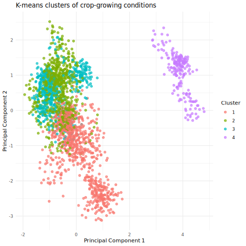
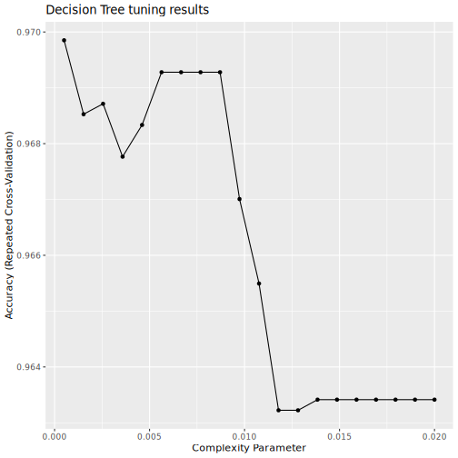
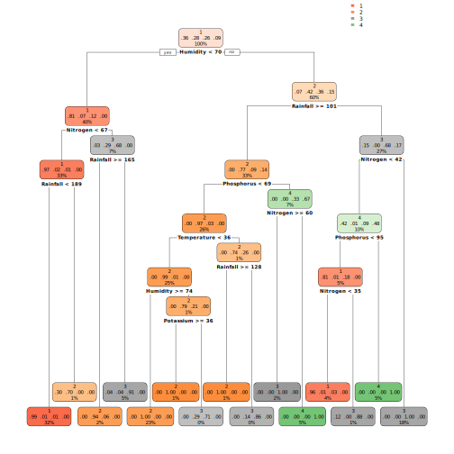
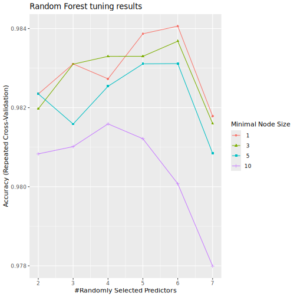
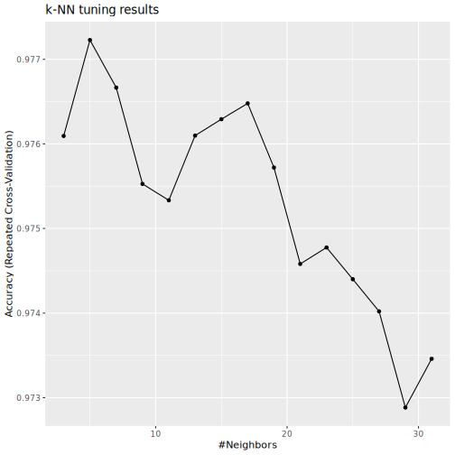
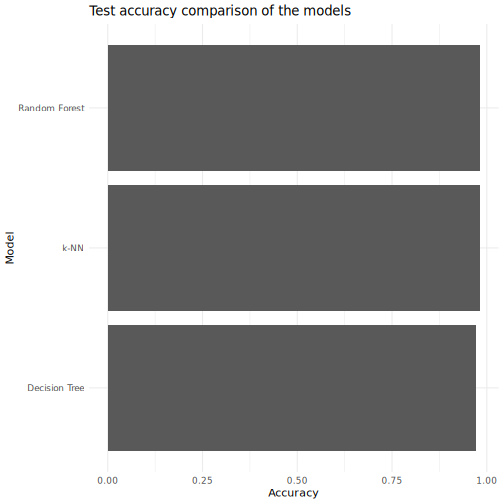
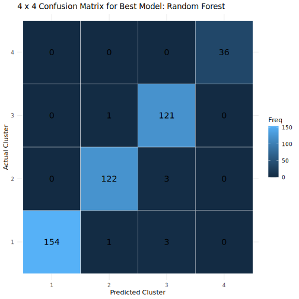

``` r
library(dplyr)
```

```
## 
## Attaching package: 'dplyr'
```

```
## The following objects are masked from 'package:stats':
## 
##     filter, lag
```

```
## The following objects are masked from 'package:base':
## 
##     intersect, setdiff, setequal, union
```

``` r
library(ggplot2)
library(caret)
```

```
## Loading required package: lattice
```

``` r
library(rsample)
```

```
## 
## Attaching package: 'rsample'
```

```
## The following object is masked from 'package:caret':
## 
##     calibration
```

``` r
library(rpart)
library(rpart.plot)
library(randomForest)
```

```
## randomForest 4.7-1.2
```

```
## Type rfNews() to see new features/changes/bug fixes.
```

```
## 
## Attaching package: 'randomForest'
```

```
## The following object is masked from 'package:ggplot2':
## 
##     margin
```

```
## The following object is masked from 'package:dplyr':
## 
##     combine
```

``` r
library(ranger)
```

```
## 
## Attaching package: 'ranger'
```

```
## The following object is masked from 'package:randomForest':
## 
##     importance
```

``` r
library(cluster)
library(class)
```

# 1. Read the crop dataset


``` r
crop_data <- read.csv("Crop_Recommendation.csv")

# Check the structure
str(crop_data)
```

```
## 'data.frame':	2200 obs. of  8 variables:
##  $ Nitrogen   : int  90 85 60 74 78 69 69 94 89 68 ...
##  $ Phosphorus : int  42 58 55 35 42 37 55 53 54 58 ...
##  $ Potassium  : int  43 41 44 40 42 42 38 40 38 38 ...
##  $ Temperature: num  20.9 21.8 23 26.5 20.1 ...
##  $ Humidity   : num  82 80.3 82.3 80.2 81.6 ...
##  $ pH_Value   : num  6.5 7.04 7.84 6.98 7.63 ...
##  $ Rainfall   : num  203 227 264 243 263 ...
##  $ Crop       : chr  "Rice" "Rice" "Rice" "Rice" ...
```

``` r
head(crop_data)
```

```
##   Nitrogen Phosphorus Potassium Temperature Humidity pH_Value Rainfall Crop
## 1       90         42        43    20.87974 82.00274 6.502985 202.9355 Rice
## 2       85         58        41    21.77046 80.31964 7.038096 226.6555 Rice
## 3       60         55        44    23.00446 82.32076 7.840207 263.9642 Rice
## 4       74         35        40    26.49110 80.15836 6.980401 242.8640 Rice
## 5       78         42        42    20.13017 81.60487 7.628473 262.7173 Rice
## 6       69         37        42    23.05805 83.37012 7.073454 251.0550 Rice
```

``` r
# Make sure the response variable is a factor
crop_data$Crop <- as.factor(crop_data$Crop)
```

# 2.Keep only the variables needed


``` r
crop_data <- crop_data %>%
  dplyr::select(
    Nitrogen,
    Phosphorus,
    Potassium,
    Temperature,
    Humidity,
    pH_Value,
    Rainfall,
    Crop
  )
```

# 3. Group the observations using K-means


``` r
# K-means uses only numeric predictors, not the crop label
cluster_data <- crop_data %>%
  dplyr::select(
    Nitrogen,
    Phosphorus,
    Potassium,
    Temperature,
    Humidity,
    pH_Value,
    Rainfall
  )

# Standardize the variables before clustering
cluster_data_scaled <- scale(cluster_data)
```

# 4. Create 4 clusters


``` r
set.seed(4050)

best_k <- 4
best_k
```

```
## [1] 4
```
# 5.Fit the final K-means model


``` r
set.seed(4050)
km_final <- kmeans(cluster_data_scaled, centers = best_k, nstart = 25)

crop_data$Cluster <- as.factor(km_final$cluster)

# Show how crops are distributed inside clusters
table(crop_data$Cluster, crop_data$Crop)
```

```
##    
##     Apple Banana Blackgram ChickPea Coconut Coffee Cotton Grapes Jute
##   1     0      0       100      100       0      0      0      0    0
##   2     0      0         0        0     100     47      0      0   99
##   3     0    100         0        0       0     53    100      0    1
##   4   100      0         0        0       0      0      0    100    0
##    
##     KidneyBeans Lentil Maize Mango MothBeans MungBean Muskmelon Orange Papaya
##   1         100    100    18   100       100       91         0      0      0
##   2           0      0     0     0         0        0         0    100     60
##   3           0      0    82     0         0        9       100      0     40
##   4           0      0     0     0         0        0         0      0      0
##    
##     PigeonPeas Pomegranate Rice Watermelon
##   1         88           0    0          0
##   2         12         100  100          0
##   3          0           0    0        100
##   4          0           0    0          0
```
# 6. Visualize the clusters using PCA


``` r
pca_fit <- prcomp(cluster_data_scaled)

pca_df <- data.frame(
  PC1 = pca_fit$x[, 1],
  PC2 = pca_fit$x[, 2],
  Cluster = crop_data$Cluster,
  Crop = crop_data$Crop
)

ggplot(pca_df, aes(x = PC1, y = PC2, color = Cluster)) +
  geom_point(alpha = 0.7, size = 2) +
  labs(
    title = "K-means clusters of crop-growing conditions",
    x = "Principal Component 1",
    y = "Principal Component 2"
  ) +
  theme_minimal()
```




# Classification part


# 7. Create training and testing data


``` r
set.seed(4050)

crop_split <- initial_split(crop_data, prop = 0.80, strata = Cluster)

train_data <- training(crop_split)
test_data  <- testing(crop_split)

# Use only the original predictors for classification
train_model <- train_data %>%
  dplyr::select(
    Cluster,
    Nitrogen,
    Phosphorus,
    Potassium,
    Temperature,
    Humidity,
    pH_Value,
    Rainfall
  )

test_model <- test_data %>%
  dplyr::select(
    Cluster,
    Nitrogen,
    Phosphorus,
    Potassium,
    Temperature,
    Humidity,
    pH_Value,
    Rainfall
  )
```

# 8. Set cross-validation control


``` r
set.seed(4050)

cv_ctrl <- trainControl(
  method = "repeatedcv",
  number = 10,
  repeats = 3
)
```

# 9. Decision Tree with hyperparameter tuning


``` r
tree_grid <- expand.grid(
  cp = seq(0.0005, 0.02, length.out = 20)
)

set.seed(4050)
tree_model <- train(
  Cluster ~ .,
  data = train_model,
  method = "rpart",
  trControl = cv_ctrl,
  tuneGrid = tree_grid,
  metric = "Accuracy"
)

tree_model
```

```
## CART 
## 
## 1759 samples
##    7 predictor
##    4 classes: '1', '2', '3', '4' 
## 
## No pre-processing
## Resampling: Cross-Validated (10 fold, repeated 3 times) 
## Summary of sample sizes: 1584, 1584, 1581, 1584, 1583, 1583, ... 
## Resampling results across tuning parameters:
## 
##   cp           Accuracy   Kappa    
##   0.000500000  0.9698521  0.9576070
##   0.001526316  0.9685273  0.9557311
##   0.002552632  0.9687146  0.9559849
##   0.003578947  0.9677665  0.9546471
##   0.004605263  0.9683347  0.9554387
##   0.005631579  0.9692796  0.9567569
##   0.006657895  0.9692796  0.9567569
##   0.007684211  0.9692796  0.9567569
##   0.008710526  0.9692796  0.9567569
##   0.009736842  0.9670068  0.9535387
##   0.010763158  0.9654938  0.9513996
##   0.011789474  0.9632232  0.9481860
##   0.012815789  0.9632232  0.9481810
##   0.013842105  0.9634136  0.9484480
##   0.014868421  0.9634136  0.9484480
##   0.015894737  0.9634136  0.9484480
##   0.016921053  0.9634136  0.9484480
##   0.017947368  0.9634136  0.9484480
##   0.018973684  0.9634136  0.9484480
##   0.020000000  0.9634136  0.9484480
## 
## Accuracy was used to select the optimal model using the largest value.
## The final value used for the model was cp = 5e-04.
```

``` r
tree_model$bestTune
```

```
##      cp
## 1 5e-04
```

``` r
ggplot(tree_model) +
  labs(title = "Decision Tree tuning results")
```

```
## Warning: `aes_string()` was deprecated in ggplot2 3.0.0.
## ℹ Please use tidy evaluation idioms with `aes()`.
## ℹ See also `vignette("ggplot2-in-packages")` for more information.
## ℹ The deprecated feature was likely used in the caret package.
##   Please report the issue at <https://github.com/topepo/caret/issues>.
## This warning is displayed once per session.
## Call `lifecycle::last_lifecycle_warnings()` to see where this warning was
## generated.
```



``` r
rpart.plot(tree_model$finalModel)
```



# 10. Test performance for Decision Tree


``` r
tree_pred <- predict(tree_model, newdata = test_model)

tree_cm <- confusionMatrix(
  data = tree_pred,
  reference = test_model$Cluster
)

tree_cm
```

```
## Confusion Matrix and Statistics
## 
##           Reference
## Prediction   1   2   3   4
##          1 154   2   1   0
##          2   1 119   1   0
##          3   3   3 120   0
##          4   0   1   0  36
## 
## Overall Statistics
##                                          
##                Accuracy : 0.9728         
##                  95% CI : (0.953, 0.9859)
##     No Information Rate : 0.3583         
##     P-Value [Acc > NIR] : < 2.2e-16      
##                                          
##                   Kappa : 0.9616         
##                                          
##  Mcnemar's Test P-Value : NA             
## 
## Statistics by Class:
## 
##                      Class: 1 Class: 2 Class: 3 Class: 4
## Sensitivity            0.9747   0.9520   0.9836  1.00000
## Specificity            0.9894   0.9937   0.9812  0.99753
## Pos Pred Value         0.9809   0.9835   0.9524  0.97297
## Neg Pred Value         0.9859   0.9812   0.9937  1.00000
## Prevalence             0.3583   0.2834   0.2766  0.08163
## Detection Rate         0.3492   0.2698   0.2721  0.08163
## Detection Prevalence   0.3560   0.2744   0.2857  0.08390
## Balanced Accuracy      0.9820   0.9728   0.9824  0.99877
```

# 11. Random Forest with hyperparameter tuning


``` r
rf_grid <- expand.grid(
  mtry = 2:7,
  splitrule = "gini",
  min.node.size = c(1, 3, 5, 10)
)

set.seed(4050)
rf_model <- train(
  Cluster ~ .,
  data = train_model,
  method = "ranger",
  trControl = cv_ctrl,
  tuneGrid = rf_grid,
  metric = "Accuracy",
  num.trees = 500,
  importance = "impurity"
)

rf_model
```

```
## Random Forest 
## 
## 1759 samples
##    7 predictor
##    4 classes: '1', '2', '3', '4' 
## 
## No pre-processing
## Resampling: Cross-Validated (10 fold, repeated 3 times) 
## Summary of sample sizes: 1584, 1584, 1581, 1584, 1583, 1583, ... 
## Resampling results across tuning parameters:
## 
##   mtry  min.node.size  Accuracy   Kappa    
##   2      1             0.9823450  0.9751445
##   2      3             0.9819694  0.9746177
##   2      5             0.9823482  0.9751495
##   2     10             0.9808309  0.9730142
##   3      1             0.9831047  0.9762233
##   3      3             0.9830993  0.9762122
##   3      5             0.9815852  0.9740811
##   3     10             0.9810148  0.9732892
##   4      1             0.9827281  0.9756976
##   4      3             0.9832974  0.9765031
##   4      5             0.9825398  0.9754356
##   4     10             0.9815895  0.9741018
##   5      1             0.9838677  0.9773096
##   5      3             0.9832985  0.9765094
##   5      5             0.9831069  0.9762389
##   5     10             0.9812139  0.9735750
##   6      1             0.9840614  0.9775828
##   6      3             0.9836805  0.9770447
##   6      5             0.9831134  0.9762509
##   6     10             0.9800764  0.9719755
##   7      1             0.9817854  0.9743814
##   7      3             0.9815982  0.9741188
##   7      5             0.9808438  0.9730604
##   7     10             0.9779941  0.9690503
## 
## Tuning parameter 'splitrule' was held constant at a value of gini
## Accuracy was used to select the optimal model using the largest value.
## The final values used for the model were mtry = 6, splitrule = gini
##  and min.node.size = 1.
```

``` r
rf_model$bestTune
```

```
##    mtry splitrule min.node.size
## 17    6      gini             1
```

``` r
ggplot(rf_model) +
  labs(title = "Random Forest tuning results")
```



``` r
varImp(rf_model)
```

```
## ranger variable importance
## 
##             Overall
## Humidity    100.000
## Rainfall     97.567
## Nitrogen     94.323
## Phosphorus   47.305
## Potassium    25.215
## Temperature   3.471
## pH_Value      0.000
```


# Test performance for Random Forest


``` r
rf_pred <- predict(rf_model, newdata = test_model)

rf_cm <- confusionMatrix(
  data = rf_pred,
  reference = test_model$Cluster
)

rf_cm
```

```
## Confusion Matrix and Statistics
## 
##           Reference
## Prediction   1   2   3   4
##          1 154   0   0   0
##          2   1 122   1   0
##          3   3   3 121   0
##          4   0   0   0  36
## 
## Overall Statistics
##                                           
##                Accuracy : 0.9819          
##                  95% CI : (0.9646, 0.9921)
##     No Information Rate : 0.3583          
##     P-Value [Acc > NIR] : < 2.2e-16       
##                                           
##                   Kappa : 0.9744          
##                                           
##  Mcnemar's Test P-Value : NA              
## 
## Statistics by Class:
## 
##                      Class: 1 Class: 2 Class: 3 Class: 4
## Sensitivity            0.9747   0.9760   0.9918  1.00000
## Specificity            1.0000   0.9937   0.9812  1.00000
## Pos Pred Value         1.0000   0.9839   0.9528  1.00000
## Neg Pred Value         0.9861   0.9905   0.9968  1.00000
## Prevalence             0.3583   0.2834   0.2766  0.08163
## Detection Rate         0.3492   0.2766   0.2744  0.08163
## Detection Prevalence   0.3492   0.2812   0.2880  0.08163
## Balanced Accuracy      0.9873   0.9848   0.9865  1.00000
```

# 13. k-NN classification with hyperparameter tuning


``` r
knn_grid <- expand.grid(
  k = seq(3, 31, by = 2)
)

set.seed(4050)
knn_model <- train(
  Cluster ~ .,
  data = train_model,
  method = "knn",
  trControl = cv_ctrl,
  tuneGrid = knn_grid,
  metric = "Accuracy",
  preProcess = c("center", "scale")
)

knn_model
```

```
## k-Nearest Neighbors 
## 
## 1759 samples
##    7 predictor
##    4 classes: '1', '2', '3', '4' 
## 
## Pre-processing: centered (7), scaled (7) 
## Resampling: Cross-Validated (10 fold, repeated 3 times) 
## Summary of sample sizes: 1584, 1584, 1581, 1584, 1583, 1583, ... 
## Resampling results across tuning parameters:
## 
##   k   Accuracy   Kappa    
##    3  0.9760937  0.9663741
##    5  0.9772279  0.9679627
##    7  0.9766651  0.9671858
##    9  0.9755266  0.9655816
##   11  0.9753329  0.9653095
##   13  0.9760980  0.9663873
##   15  0.9762917  0.9666610
##   17  0.9764789  0.9669201
##   19  0.9757203  0.9658515
##   21  0.9745806  0.9642469
##   23  0.9747755  0.9645243
##   25  0.9743998  0.9639953
##   27  0.9740200  0.9634610
##   29  0.9728825  0.9618612
##   31  0.9734593  0.9626703
## 
## Accuracy was used to select the optimal model using the largest value.
## The final value used for the model was k = 5.
```

``` r
knn_model$bestTune
```

```
##   k
## 2 5
```

``` r
ggplot(knn_model) +
  labs(title = "k-NN tuning results")
```




# 14. Test performance for k-NN


``` r
knn_pred <- predict(knn_model, newdata = test_model)

knn_cm <- confusionMatrix(
  data = knn_pred,
  reference = test_model$Cluster
)

knn_cm
```

```
## Confusion Matrix and Statistics
## 
##           Reference
## Prediction   1   2   3   4
##          1 157   0   2   0
##          2   0 121   1   0
##          3   1   4 119   0
##          4   0   0   0  36
## 
## Overall Statistics
##                                           
##                Accuracy : 0.9819          
##                  95% CI : (0.9646, 0.9921)
##     No Information Rate : 0.3583          
##     P-Value [Acc > NIR] : < 2.2e-16       
##                                           
##                   Kappa : 0.9744          
##                                           
##  Mcnemar's Test P-Value : NA              
## 
## Statistics by Class:
## 
##                      Class: 1 Class: 2 Class: 3 Class: 4
## Sensitivity            0.9937   0.9680   0.9754  1.00000
## Specificity            0.9929   0.9968   0.9843  1.00000
## Pos Pred Value         0.9874   0.9918   0.9597  1.00000
## Neg Pred Value         0.9965   0.9875   0.9905  1.00000
## Prevalence             0.3583   0.2834   0.2766  0.08163
## Detection Rate         0.3560   0.2744   0.2698  0.08163
## Detection Prevalence   0.3605   0.2766   0.2812  0.08163
## Balanced Accuracy      0.9933   0.9824   0.9799  1.00000
```
# 15. Compare the models on the test set


``` r
model_results <- data.frame(
  Model = c("Decision Tree", "Random Forest", "k-NN"),
  Accuracy = c(
    as.numeric(tree_cm$overall["Accuracy"]),
    as.numeric(rf_cm$overall["Accuracy"]),
    as.numeric(knn_cm$overall["Accuracy"])
  ),
  Kappa = c(
    as.numeric(tree_cm$overall["Kappa"]),
    as.numeric(rf_cm$overall["Kappa"]),
    as.numeric(knn_cm$overall["Kappa"])
  )
)

model_results <- model_results %>%
  arrange(desc(Accuracy))

print(model_results)
```

```
##           Model  Accuracy     Kappa
## 1 Random Forest 0.9818594 0.9744086
## 2          k-NN 0.9818594 0.9743763
## 3 Decision Tree 0.9727891 0.9616093
```

``` r
ggplot(model_results, aes(x = reorder(Model, Accuracy), y = Accuracy)) +
  geom_col() +
  coord_flip() +
  labs(
    title = "Test accuracy comparison of the models",
    x = "Model",
    y = "Accuracy"
  ) +
  theme_minimal()
```



# 16. Identify the best model


``` r
best_model_name <- model_results$Model[1]
best_model_name
```

```
## [1] "Random Forest"
```

``` r
# Show the confusion matrix for the best model
if (best_model_name == "Decision Tree") {
  best_cm <- tree_cm
  best_pred <- tree_pred
} else if (best_model_name == "Random Forest") {
  best_cm <- rf_cm
  best_pred <- rf_pred
} else {
  best_cm <- knn_cm
  best_pred <- knn_pred
}

best_cm
```

```
## Confusion Matrix and Statistics
## 
##           Reference
## Prediction   1   2   3   4
##          1 154   0   0   0
##          2   1 122   1   0
##          3   3   3 121   0
##          4   0   0   0  36
## 
## Overall Statistics
##                                           
##                Accuracy : 0.9819          
##                  95% CI : (0.9646, 0.9921)
##     No Information Rate : 0.3583          
##     P-Value [Acc > NIR] : < 2.2e-16       
##                                           
##                   Kappa : 0.9744          
##                                           
##  Mcnemar's Test P-Value : NA              
## 
## Statistics by Class:
## 
##                      Class: 1 Class: 2 Class: 3 Class: 4
## Sensitivity            0.9747   0.9760   0.9918  1.00000
## Specificity            1.0000   0.9937   0.9812  1.00000
## Pos Pred Value         1.0000   0.9839   0.9528  1.00000
## Neg Pred Value         0.9861   0.9905   0.9968  1.00000
## Prevalence             0.3583   0.2834   0.2766  0.08163
## Detection Rate         0.3492   0.2766   0.2744  0.08163
## Detection Prevalence   0.3492   0.2812   0.2880  0.08163
## Balanced Accuracy      0.9873   0.9848   0.9865  1.00000
```

# 17. Show a few final predictions


``` r
final_predictions <- data.frame(
  Actual_Cluster = test_model$Cluster,
  Predicted_Cluster = best_pred
)

# Show the first 50 predictions
head(final_predictions, 50)
```

```
##    Actual_Cluster Predicted_Cluster
## 1               2                 2
## 2               2                 2
## 3               2                 2
## 4               2                 2
## 5               2                 2
## 6               2                 2
## 7               2                 2
## 8               2                 2
## 9               2                 2
## 10              2                 2
## 11              2                 2
## 12              2                 2
## 13              2                 2
## 14              2                 2
## 15              2                 2
## 16              2                 2
## 17              2                 2
## 18              2                 2
## 19              2                 2
## 20              2                 2
## 21              1                 1
## 22              3                 3
## 23              3                 3
## 24              3                 3
## 25              3                 3
## 26              3                 3
## 27              1                 1
## 28              1                 3
## 29              3                 3
## 30              3                 3
## 31              3                 3
## 32              3                 3
## 33              3                 3
## 34              3                 3
## 35              3                 3
## 36              3                 3
## 37              3                 3
## 38              1                 1
## 39              3                 3
## 40              1                 1
## 41              1                 1
## 42              1                 1
## 43              1                 1
## 44              1                 1
## 45              1                 1
## 46              1                 1
## 47              1                 1
## 48              1                 1
## 49              1                 1
## 50              1                 1
```


``` r
# Or show 30 random predictions
set.seed(4050)

final_predictions %>%
  sample_n(30)
```

```
##    Actual_Cluster Predicted_Cluster
## 1               1                 1
## 2               2                 2
## 3               3                 3
## 4               3                 3
## 5               3                 3
## 6               3                 3
## 7               3                 3
## 8               1                 1
## 9               4                 4
## 10              3                 3
## 11              3                 3
## 12              2                 2
## 13              1                 1
## 14              3                 3
## 15              4                 4
## 16              1                 1
## 17              1                 1
## 18              2                 2
## 19              2                 2
## 20              1                 1
## 21              2                 2
## 22              1                 1
## 23              1                 3
## 24              2                 2
## 25              1                 1
## 26              1                 1
## 27              1                 1
## 28              2                 2
## 29              3                 3
## 30              1                 1
```

# 19. Create prediction data frames for each model


``` r
library(yardstick)
```

```
## 
## Attaching package: 'yardstick'
```

```
## The following objects are masked from 'package:caret':
## 
##     precision, recall, sensitivity, specificity
```

``` r
tree_results <- data.frame(
  truth = test_model$Cluster,
  estimate = tree_pred
)

rf_results <- data.frame(
  truth = test_model$Cluster,
  estimate = rf_pred
)

knn_results <- data.frame(
  truth = test_model$Cluster,
  estimate = knn_pred
)

tree_results$truth <- as.factor(tree_results$truth)
tree_results$estimate <- as.factor(tree_results$estimate)

rf_results$truth <- as.factor(rf_results$truth)
rf_results$estimate <- as.factor(rf_results$estimate)

knn_results$truth <- as.factor(knn_results$truth)
knn_results$estimate <- as.factor(knn_results$estimate)
```

# 20. Overall model comparison


``` r
tree_metrics <- dplyr::bind_rows(
  yardstick::accuracy(tree_results, truth = truth, estimate = estimate),
  yardstick::precision(tree_results, truth = truth, estimate = estimate, estimator = "macro"),
  yardstick::recall(tree_results, truth = truth, estimate = estimate, estimator = "macro"),
  yardstick::f_meas(tree_results, truth = truth, estimate = estimate, estimator = "macro")
) %>%
  dplyr::mutate(Model = "Decision Tree")

rf_metrics <- dplyr::bind_rows(
  yardstick::accuracy(rf_results, truth = truth, estimate = estimate),
  yardstick::precision(rf_results, truth = truth, estimate = estimate, estimator = "macro"),
  yardstick::recall(rf_results, truth = truth, estimate = estimate, estimator = "macro"),
  yardstick::f_meas(rf_results, truth = truth, estimate = estimate, estimator = "macro")
) %>%
  dplyr::mutate(Model = "Random Forest")

knn_metrics <- dplyr::bind_rows(
  yardstick::accuracy(knn_results, truth = truth, estimate = estimate),
  yardstick::precision(knn_results, truth = truth, estimate = estimate, estimator = "macro"),
  yardstick::recall(knn_results, truth = truth, estimate = estimate, estimator = "macro"),
  yardstick::f_meas(knn_results, truth = truth, estimate = estimate, estimator = "macro")
) %>%
  dplyr::mutate(Model = "k-NN")

all_metrics <- dplyr::bind_rows(tree_metrics, rf_metrics, knn_metrics) %>%
  dplyr::select(Model, .metric, .estimate)

print(all_metrics)
```

```
## # A tibble: 12 × 3
##    Model         .metric   .estimate
##    <chr>         <chr>         <dbl>
##  1 Decision Tree accuracy      0.973
##  2 Decision Tree precision     0.972
##  3 Decision Tree recall        0.978
##  4 Decision Tree f_meas        0.975
##  5 Random Forest accuracy      0.982
##  6 Random Forest precision     0.984
##  7 Random Forest recall        0.986
##  8 Random Forest f_meas        0.985
##  9 k-NN          accuracy      0.982
## 10 k-NN          precision     0.985
## 11 k-NN          recall        0.984
## 12 k-NN          f_meas        0.984
```


``` r
library(tidyr)

metrics_table <- all_metrics %>%
  pivot_wider(names_from = .metric, values_from = .estimate)

print(metrics_table)
```

```
## # A tibble: 3 × 5
##   Model         accuracy precision recall f_meas
##   <chr>            <dbl>     <dbl>  <dbl>  <dbl>
## 1 Decision Tree    0.973     0.972  0.978  0.975
## 2 Random Forest    0.982     0.984  0.986  0.985
## 3 k-NN             0.982     0.985  0.984  0.984
```


``` r
confusionMatrix(rf_pred, test_model$Cluster)
```

```
## Confusion Matrix and Statistics
## 
##           Reference
## Prediction   1   2   3   4
##          1 154   0   0   0
##          2   1 122   1   0
##          3   3   3 121   0
##          4   0   0   0  36
## 
## Overall Statistics
##                                           
##                Accuracy : 0.9819          
##                  95% CI : (0.9646, 0.9921)
##     No Information Rate : 0.3583          
##     P-Value [Acc > NIR] : < 2.2e-16       
##                                           
##                   Kappa : 0.9744          
##                                           
##  Mcnemar's Test P-Value : NA              
## 
## Statistics by Class:
## 
##                      Class: 1 Class: 2 Class: 3 Class: 4
## Sensitivity            0.9747   0.9760   0.9918  1.00000
## Specificity            1.0000   0.9937   0.9812  1.00000
## Pos Pred Value         1.0000   0.9839   0.9528  1.00000
## Neg Pred Value         0.9861   0.9905   0.9968  1.00000
## Prevalence             0.3583   0.2834   0.2766  0.08163
## Detection Rate         0.3492   0.2766   0.2744  0.08163
## Detection Prevalence   0.3492   0.2812   0.2880  0.08163
## Balanced Accuracy      0.9873   0.9848   0.9865  1.00000
```
# 21. Plot confusion matrix for the best model


``` r
# Get predictions from the best model
if (best_model_name == "Decision Tree") {
  best_pred <- tree_pred
} else if (best_model_name == "Random Forest") {
  best_pred <- rf_pred
} else {
  best_pred <- knn_pred
}

best_results <- data.frame(
  Actual = test_model$Cluster,
  Predicted = best_pred
)

best_results$Actual <- factor(best_results$Actual, levels = c("1", "2", "3", "4"))
best_results$Predicted <- factor(best_results$Predicted, levels = c("1", "2", "3", "4"))

best_cm_4x4 <- table(best_results$Actual, best_results$Predicted)
best_cm_4x4
```

```
##    
##       1   2   3   4
##   1 154   1   3   0
##   2   0 122   3   0
##   3   0   1 121   0
##   4   0   0   0  36
```

``` r
best_cm_plot <- as.data.frame(best_cm_4x4)

colnames(best_cm_plot) <- c("Actual", "Predicted", "Freq")

ggplot(best_cm_plot, aes(x = Predicted, y = Actual, fill = Freq)) +
  geom_tile(color = "white") +
  geom_text(aes(label = Freq), size = 5) +
  labs(
    title = paste("4 x 4 Confusion Matrix for Best Model:", best_model_name),
    x = "Predicted Cluster",
    y = "Actual Cluster"
  ) +
  theme_minimal()
```




