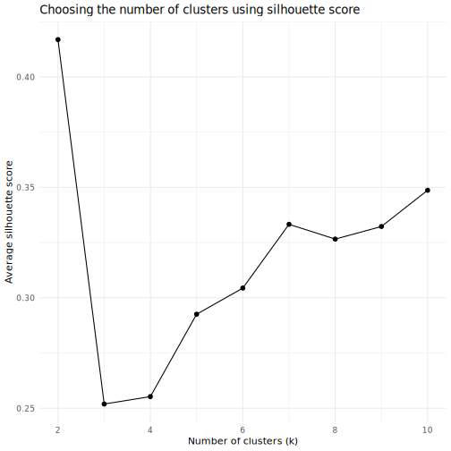
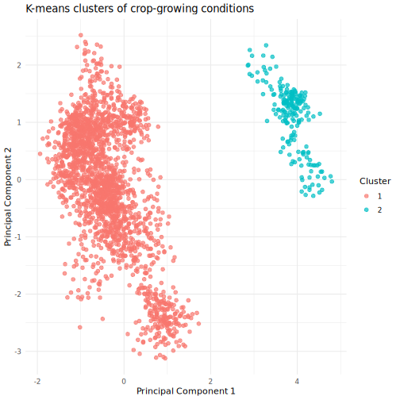
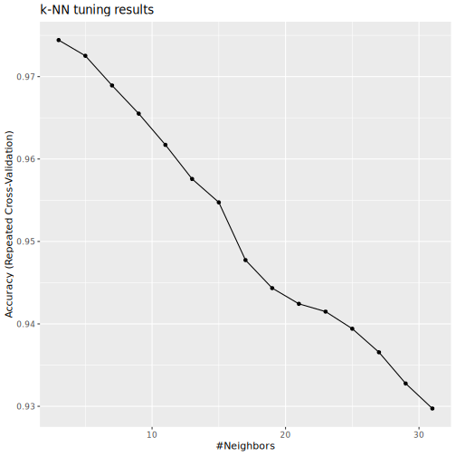
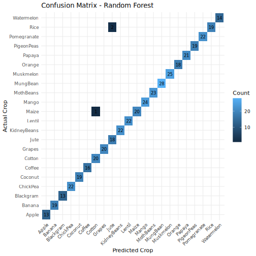
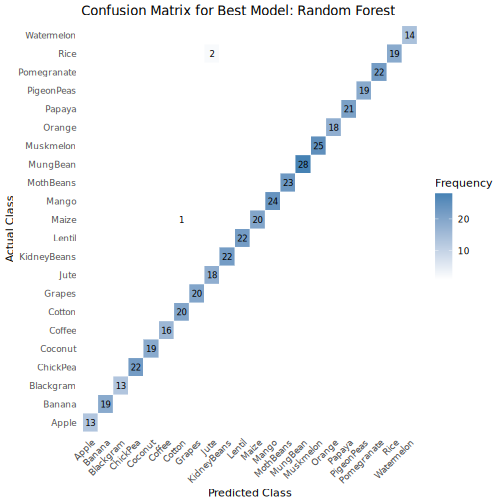

``` r
.libPaths()
```

```
## [1] "/usr/local/lib/R/site-library" "/usr/lib/R/site-library"      
## [3] "/usr/lib/R/library"
```

``` r
user_lib <- path.expand("~/R/library")
if (!dir.exists(user_lib)) {
  dir.create(user_lib, recursive = TRUE)
}

.libPaths(c(user_lib, .libPaths()))

required_pkgs <- c(
  "dplyr", "ggplot2", "caret", "rsample", "rpart", "rpart.plot",
  "randomForest", "ranger", "cluster", "class", "yardstick", "tidyr"
)

missing_pkgs <- required_pkgs[!vapply(required_pkgs, requireNamespace, logical(1), quietly = TRUE)]

if (length(missing_pkgs) > 0) {
  install.packages(missing_pkgs, lib = user_lib, repos = "https://cloud.r-project.org/")
}
```

```
## also installing the dependencies 'ipred', 'recipes', 'reshape2', 'furrr', 'hardhat'
```

``` r
invisible(lapply(required_pkgs, library, character.only = TRUE))
```

```
## 
## Attaching package: 'dplyr'
```

```
## The following objects are masked from 'package:stats':
## 
##     filter, lag
```

```
## The following objects are masked from 'package:base':
## 
##     intersect, setdiff, setequal, union
```

```
## 
## Attaching package: 'ggplot2'
```

```
## The following object is masked from 'package:dplyr':
## 
##     vars
```

```
## Loading required package: lattice
```

```
## 
## Attaching package: 'rsample'
```

```
## The following object is masked from 'package:caret':
## 
##     calibration
```

```
## randomForest 4.7-1.2
```

```
## Type rfNews() to see new features/changes/bug fixes.
```

```
## 
## Attaching package: 'randomForest'
```

```
## The following object is masked from 'package:ggplot2':
## 
##     margin
```

```
## The following object is masked from 'package:dplyr':
## 
##     combine
```

```
## 
## Attaching package: 'ranger'
```

```
## The following object is masked from 'package:randomForest':
## 
##     importance
```

```
## 
## Attaching package: 'yardstick'
```

```
## The following objects are masked from 'package:caret':
## 
##     precision, recall, sensitivity, specificity
```


# 2. Read the crop dataset

``` r
crop_data <- read.csv("Crop_Recommendation.csv")

# Check the structure
str(crop_data)
```

```
## 'data.frame':	2200 obs. of  8 variables:
##  $ Nitrogen   : int  90 85 60 74 78 69 69 94 89 68 ...
##  $ Phosphorus : int  42 58 55 35 42 37 55 53 54 58 ...
##  $ Potassium  : int  43 41 44 40 42 42 38 40 38 38 ...
##  $ Temperature: num  20.9 21.8 23 26.5 20.1 ...
##  $ Humidity   : num  82 80.3 82.3 80.2 81.6 ...
##  $ pH_Value   : num  6.5 7.04 7.84 6.98 7.63 ...
##  $ Rainfall   : num  203 227 264 243 263 ...
##  $ Crop       : chr  "Rice" "Rice" "Rice" "Rice" ...
```

``` r
head(crop_data)
```

```
##   Nitrogen Phosphorus Potassium Temperature Humidity pH_Value Rainfall Crop
## 1       90         42        43    20.87974 82.00274 6.502985 202.9355 Rice
## 2       85         58        41    21.77046 80.31964 7.038096 226.6555 Rice
## 3       60         55        44    23.00446 82.32076 7.840207 263.9642 Rice
## 4       74         35        40    26.49110 80.15836 6.980401 242.8640 Rice
## 5       78         42        42    20.13017 81.60487 7.628473 262.7173 Rice
## 6       69         37        42    23.05805 83.37012 7.073454 251.0550 Rice
```

``` r
# Make sure the response variable is a factor
crop_data$Crop <- as.factor(crop_data$Crop)
```

# 3. Keep only the variables needed


``` r
crop_data <- crop_data %>%
  dplyr::select(
    Nitrogen,
    Phosphorus,
    Potassium,
    Temperature,
    Humidity,
    pH_Value,
    Rainfall,
    Crop
  )
```

# 4. Group the observations using K-means


``` r
# K-means uses only numeric predictors, not the crop label
cluster_data <- crop_data %>%
  dplyr::select(
    Nitrogen,
    Phosphorus,
    Potassium,
    Temperature,
    Humidity,
    pH_Value,
    Rainfall
  )

# Standardize the variables before clustering
cluster_data_scaled <- scale(cluster_data)
```

# 5. Find a good number of clusters using silhouette score


``` r
set.seed(4050)

k_values <- 2:10
sil_scores <- numeric(length(k_values))

for (i in seq_along(k_values)) {
  km_fit <- kmeans(cluster_data_scaled, centers = k_values[i], nstart = 25)
  sil <- silhouette(km_fit$cluster, dist(cluster_data_scaled))
  sil_scores[i] <- mean(sil[, 3])
}

sil_results <- data.frame(
  k = k_values,
  Avg_Silhouette = sil_scores
)

print(sil_results)
```

```
##    k Avg_Silhouette
## 1  2      0.4168458
## 2  3      0.2519110
## 3  4      0.2552692
## 4  5      0.2925554
## 5  6      0.3043865
## 6  7      0.3332519
## 7  8      0.3265726
## 8  9      0.3322695
## 9 10      0.3486718
```

``` r
ggplot(sil_results, aes(x = k, y = Avg_Silhouette)) +
  geom_line() +
  geom_point(size = 2) +
  labs(
    title = "Choosing the number of clusters using silhouette score",
    x = "Number of clusters (k)",
    y = "Average silhouette score"
  ) +
  theme_minimal()
```



``` r
best_k <- sil_results$k[which.max(sil_results$Avg_Silhouette)]
best_k
```

```
## [1] 2
```


# 6. Fit the final K-means model


``` r
set.seed(4050)
km_final <- kmeans(cluster_data_scaled, centers = best_k, nstart = 25)

crop_data$Cluster <- as.factor(km_final$cluster)

# Show how crops are distributed inside clusters
table(crop_data$Cluster, crop_data$Crop)
```

```
##    
##     Apple Banana Blackgram ChickPea Coconut Coffee Cotton Grapes Jute
##   1     0    100       100      100     100    100    100      0  100
##   2   100      0         0        0       0      0      0    100    0
##    
##     KidneyBeans Lentil Maize Mango MothBeans MungBean Muskmelon Orange Papaya
##   1         100    100   100   100       100      100       100    100    100
##   2           0      0     0     0         0        0         0      0      0
##    
##     PigeonPeas Pomegranate Rice Watermelon
##   1        100         100  100        100
##   2          0           0    0          0
```


# 7. Visualize the clusters using PCA


``` r
pca_fit <- prcomp(cluster_data_scaled)
pca_df <- data.frame(
  PC1 = pca_fit$x[, 1],
  PC2 = pca_fit$x[, 2],
  Cluster = crop_data$Cluster,
  Crop = crop_data$Crop
)

ggplot(pca_df, aes(x = PC1, y = PC2, color = Cluster)) +
  geom_point(alpha = 0.7, size = 2) +
  labs(
    title = "K-means clusters of crop-growing conditions",
    x = "Principal Component 1",
    y = "Principal Component 2"
  ) +
  theme_minimal()
```



# Classification part

# 8. Create training and testing data


``` r
set.seed(4050)

crop_split <- initial_split(crop_data, prop = 0.80, strata = Crop)
```

```
## Warning: Too little data to stratify.
## • Resampling will be unstratified.
```

``` r
train_data <- training(crop_split)
test_data  <- testing(crop_split)

# Use only the original predictors for classification
train_model <- train_data %>%
  dplyr::select(
    Crop,
    Nitrogen,
    Phosphorus,
    Potassium,
    Temperature,
    Humidity,
    pH_Value,
    Rainfall
  )

test_model <- test_data %>%
  dplyr::select(
    Crop,
    Nitrogen,
    Phosphorus,
    Potassium,
    Temperature,
    Humidity,
    pH_Value,
    Rainfall
  )
```

# 9. Set cross-validation control


``` r
set.seed(4050)

cv_ctrl <- trainControl(
  method = "repeatedcv",
  number = 10,
  repeats = 3
)
```


# 10. Decision Tree with hyperparameter tuning


``` r
tree_grid <- expand.grid(
  cp = seq(0.0005, 0.02, length.out = 20)
)

set.seed(4050)
tree_model <- train(
  Crop ~ .,
  data = train_model,
  method = "rpart",
  trControl = cv_ctrl,
  tuneGrid = tree_grid,
  metric = "Accuracy"
)

tree_model
```

```
## CART 
## 
## 1760 samples
##    7 predictor
##   22 classes: 'Apple', 'Banana', 'Blackgram', 'ChickPea', 'Coconut', 'Coffee', 'Cotton', 'Grapes', 'Jute', 'KidneyBeans', 'Lentil', 'Maize', 'Mango', 'MothBeans', 'MungBean', 'Muskmelon', 'Orange', 'Papaya', 'PigeonPeas', 'Pomegranate', 'Rice', 'Watermelon' 
## 
## No pre-processing
## Resampling: Cross-Validated (10 fold, repeated 3 times) 
## Summary of sample sizes: 1585, 1581, 1583, 1585, 1583, 1590, ... 
## Resampling results across tuning parameters:
## 
##   cp           Accuracy   Kappa    
##   0.000500000  0.9802591  0.9793144
##   0.001526316  0.9768334  0.9757252
##   0.002552632  0.9785293  0.9775024
##   0.003578947  0.9753326  0.9741529
##   0.004605263  0.9751443  0.9739555
##   0.005631579  0.9730611  0.9717723
##   0.006657895  0.9681483  0.9666251
##   0.007684211  0.9653242  0.9636663
##   0.008710526  0.9651315  0.9634645
##   0.009736842  0.9651315  0.9634645
##   0.010763158  0.9651315  0.9634645
##   0.011789474  0.9651315  0.9634645
##   0.012815789  0.9622873  0.9604835
##   0.013842105  0.9586983  0.9567221
##   0.014868421  0.9528512  0.9505925
##   0.015894737  0.9515262  0.9492033
##   0.016921053  0.9517145  0.9494006
##   0.017947368  0.9517145  0.9494006
##   0.018973684  0.9517145  0.9494006
##   0.020000000  0.9517145  0.9494006
## 
## Accuracy was used to select the optimal model using the largest value.
## The final value used for the model was cp = 5e-04.
```

``` r
tree_model$bestTune
```

```
##      cp
## 1 5e-04
```

``` r
ggplot(tree_model) +
  labs(title = "Decision Tree tuning results")
```

```
## Warning: `aes_string()` was deprecated in ggplot2 3.0.0.
## ℹ Please use tidy evaluation idioms with `aes()`.
## ℹ See also `vignette("ggplot2-in-packages")` for more information.
## ℹ The deprecated feature was likely used in the caret package.
##   Please report the issue at <https://github.com/topepo/caret/issues>.
## This warning is displayed once per session.
## Call `lifecycle::last_lifecycle_warnings()` to see where this warning was
## generated.
```


``` r
rpart.plot(tree_model$finalModel)
```

```
## Warning: All boxes will be white (the box.palette argument will be ignored) because
## the number of classes in the response 22 is greater than length(box.palette) 6.
## To silence this warning use box.palette=0 or trace=-1.
```

```
## Warning: labs do not fit even at cex 0.15, there may be some overplotting
```


# 11. Test performance for Decision Tree


``` r
tree_pred <- predict(tree_model, newdata = test_model)

tree_cm <- confusionMatrix(
  data = tree_pred,
  reference = test_model$Crop
)

tree_cm
```

```
## Confusion Matrix and Statistics
## 
##              Reference
## Prediction    Apple Banana Blackgram ChickPea Coconut Coffee Cotton Grapes Jute
##   Apple          13      0         0        0       0      0      0      0    0
##   Banana          0     19         0        0       0      0      0      0    0
##   Blackgram       0      0        13        0       0      0      0      0    0
##   ChickPea        0      0         0       22       0      0      0      0    0
##   Coconut         0      0         0        0      19      0      0      0    0
##   Coffee          0      0         0        0       0     16      0      0    0
##   Cotton          0      0         0        0       0      0     20      0    0
##   Grapes          0      0         0        0       0      0      0     20    0
##   Jute            0      0         0        0       0      0      0      0   17
##   KidneyBeans     0      0         0        0       0      0      0      0    0
##   Lentil          0      0         0        0       0      0      0      0    0
##   Maize           0      0         0        0       0      0      0      0    0
##   Mango           0      0         0        0       0      0      0      0    0
##   MothBeans       0      0         0        0       0      0      0      0    0
##   MungBean        0      0         0        0       0      0      0      0    0
##   Muskmelon       0      0         0        0       0      0      0      0    0
##   Orange          0      0         0        0       0      0      0      0    0
##   Papaya          0      0         0        0       0      0      0      0    0
##   PigeonPeas      0      0         0        0       0      0      0      0    0
##   Pomegranate     0      0         0        0       0      0      0      0    0
##   Rice            0      0         0        0       0      0      0      0    1
##   Watermelon      0      0         0        0       0      0      0      0    0
##              Reference
## Prediction    KidneyBeans Lentil Maize Mango MothBeans MungBean Muskmelon
##   Apple                 0      0     0     0         0        0         0
##   Banana                0      0     0     0         0        0         0
##   Blackgram             0      0     0     0         1        0         0
##   ChickPea              0      0     0     0         0        0         0
##   Coconut               0      0     0     0         0        0         0
##   Coffee                0      0     0     0         0        0         0
##   Cotton                0      0     0     0         0        0         0
##   Grapes                0      0     0     0         0        0         0
##   Jute                  0      0     0     0         0        0         0
##   KidneyBeans          22      0     0     0         0        0         0
##   Lentil                0     22     0     0         0        0         0
##   Maize                 0      0    21     0         0        0         0
##   Mango                 0      0     0    24         0        0         0
##   MothBeans             0      0     0     0        22        0         0
##   MungBean              0      0     0     0         0       28         0
##   Muskmelon             0      0     0     0         0        0        25
##   Orange                0      0     0     0         0        0         0
##   Papaya                0      0     0     0         0        0         0
##   PigeonPeas            0      0     0     0         0        0         0
##   Pomegranate           0      0     0     0         0        0         0
##   Rice                  0      0     0     0         0        0         0
##   Watermelon            0      0     0     0         0        0         0
##              Reference
## Prediction    Orange Papaya PigeonPeas Pomegranate Rice Watermelon
##   Apple            0      0          0           0    0          0
##   Banana           0      0          0           0    0          0
##   Blackgram        0      0          0           0    0          0
##   ChickPea         0      0          0           0    0          0
##   Coconut          0      0          0           0    0          0
##   Coffee           0      0          0           0    0          0
##   Cotton           0      0          0           0    0          0
##   Grapes           0      0          0           0    0          0
##   Jute             0      0          0           0    2          0
##   KidneyBeans      0      0          0           0    0          0
##   Lentil           0      0          0           0    0          0
##   Maize            0      0          0           0    0          0
##   Mango            0      0          0           0    0          0
##   MothBeans        0      0          0           0    0          0
##   MungBean         0      0          0           0    0          0
##   Muskmelon        0      0          0           0    0          0
##   Orange          18      0          0           0    0          0
##   Papaya           0     21          0           0    0          0
##   PigeonPeas       0      0         19           0    0          0
##   Pomegranate      0      0          0          22    0          0
##   Rice             0      0          0           0   19          0
##   Watermelon       0      0          0           0    0         14
## 
## Overall Statistics
##                                           
##                Accuracy : 0.9909          
##                  95% CI : (0.9769, 0.9975)
##     No Information Rate : 0.0636          
##     P-Value [Acc > NIR] : < 2.2e-16       
##                                           
##                   Kappa : 0.9905          
##                                           
##  Mcnemar's Test P-Value : NA              
## 
## Statistics by Class:
## 
##                      Class: Apple Class: Banana Class: Blackgram
## Sensitivity               1.00000       1.00000          1.00000
## Specificity               1.00000       1.00000          0.99766
## Pos Pred Value            1.00000       1.00000          0.92857
## Neg Pred Value            1.00000       1.00000          1.00000
## Prevalence                0.02955       0.04318          0.02955
## Detection Rate            0.02955       0.04318          0.02955
## Detection Prevalence      0.02955       0.04318          0.03182
## Balanced Accuracy         1.00000       1.00000          0.99883
##                      Class: ChickPea Class: Coconut Class: Coffee Class: Cotton
## Sensitivity                     1.00        1.00000       1.00000       1.00000
## Specificity                     1.00        1.00000       1.00000       1.00000
## Pos Pred Value                  1.00        1.00000       1.00000       1.00000
## Neg Pred Value                  1.00        1.00000       1.00000       1.00000
## Prevalence                      0.05        0.04318       0.03636       0.04545
## Detection Rate                  0.05        0.04318       0.03636       0.04545
## Detection Prevalence            0.05        0.04318       0.03636       0.04545
## Balanced Accuracy               1.00        1.00000       1.00000       1.00000
##                      Class: Grapes Class: Jute Class: KidneyBeans Class: Lentil
## Sensitivity                1.00000     0.94444               1.00          1.00
## Specificity                1.00000     0.99526               1.00          1.00
## Pos Pred Value             1.00000     0.89474               1.00          1.00
## Neg Pred Value             1.00000     0.99762               1.00          1.00
## Prevalence                 0.04545     0.04091               0.05          0.05
## Detection Rate             0.04545     0.03864               0.05          0.05
## Detection Prevalence       0.04545     0.04318               0.05          0.05
## Balanced Accuracy          1.00000     0.96985               1.00          1.00
##                      Class: Maize Class: Mango Class: MothBeans Class: MungBean
## Sensitivity               1.00000      1.00000          0.95652         1.00000
## Specificity               1.00000      1.00000          1.00000         1.00000
## Pos Pred Value            1.00000      1.00000          1.00000         1.00000
## Neg Pred Value            1.00000      1.00000          0.99761         1.00000
## Prevalence                0.04773      0.05455          0.05227         0.06364
## Detection Rate            0.04773      0.05455          0.05000         0.06364
## Detection Prevalence      0.04773      0.05455          0.05000         0.06364
## Balanced Accuracy         1.00000      1.00000          0.97826         1.00000
##                      Class: Muskmelon Class: Orange Class: Papaya
## Sensitivity                   1.00000       1.00000       1.00000
## Specificity                   1.00000       1.00000       1.00000
## Pos Pred Value                1.00000       1.00000       1.00000
## Neg Pred Value                1.00000       1.00000       1.00000
## Prevalence                    0.05682       0.04091       0.04773
## Detection Rate                0.05682       0.04091       0.04773
## Detection Prevalence          0.05682       0.04091       0.04773
## Balanced Accuracy             1.00000       1.00000       1.00000
##                      Class: PigeonPeas Class: Pomegranate Class: Rice
## Sensitivity                    1.00000               1.00     0.90476
## Specificity                    1.00000               1.00     0.99761
## Pos Pred Value                 1.00000               1.00     0.95000
## Neg Pred Value                 1.00000               1.00     0.99524
## Prevalence                     0.04318               0.05     0.04773
## Detection Rate                 0.04318               0.05     0.04318
## Detection Prevalence           0.04318               0.05     0.04545
## Balanced Accuracy              1.00000               1.00     0.95119
##                      Class: Watermelon
## Sensitivity                    1.00000
## Specificity                    1.00000
## Pos Pred Value                 1.00000
## Neg Pred Value                 1.00000
## Prevalence                     0.03182
## Detection Rate                 0.03182
## Detection Prevalence           0.03182
## Balanced Accuracy              1.00000
```


# 12. Random Forest with hyperparameter tuning


``` r
rf_grid <- expand.grid(
  mtry = 2:7,
  splitrule = "gini",
  min.node.size = c(1, 3, 5, 10)
)

set.seed(4050)
rf_model <- train(
  Crop ~ .,
  data = train_model,
  method = "ranger",
  trControl = cv_ctrl,
  tuneGrid = rf_grid,
  metric = "Accuracy",
  num.trees = 500,
  importance = "impurity"
)

rf_model
```

```
## Random Forest 
## 
## 1760 samples
##    7 predictor
##   22 classes: 'Apple', 'Banana', 'Blackgram', 'ChickPea', 'Coconut', 'Coffee', 'Cotton', 'Grapes', 'Jute', 'KidneyBeans', 'Lentil', 'Maize', 'Mango', 'MothBeans', 'MungBean', 'Muskmelon', 'Orange', 'Papaya', 'PigeonPeas', 'Pomegranate', 'Rice', 'Watermelon' 
## 
## No pre-processing
## Resampling: Cross-Validated (10 fold, repeated 3 times) 
## Summary of sample sizes: 1585, 1581, 1583, 1585, 1583, 1590, ... 
## Resampling results across tuning parameters:
## 
##   mtry  min.node.size  Accuracy   Kappa    
##   2      1             0.9958327  0.9956333
##   2      3             0.9960245  0.9958343
##   2      5             0.9958415  0.9956425
##   2     10             0.9956401  0.9954315
##   3      1             0.9956412  0.9954326
##   3      3             0.9948803  0.9946354
##   3      5             0.9952613  0.9950346
##   3     10             0.9952613  0.9950346
##   4      1             0.9950708  0.9948350
##   4      3             0.9950708  0.9948350
##   4      5             0.9946799  0.9944253
##   4     10             0.9946887  0.9944346
##   5      1             0.9939223  0.9936314
##   5      3             0.9939223  0.9936314
##   5      5             0.9941117  0.9938299
##   5     10             0.9941117  0.9938299
##   6      1             0.9941043  0.9938220
##   6      3             0.9933552  0.9930371
##   6      5             0.9933520  0.9930337
##   6     10             0.9933530  0.9930348
##   7      1             0.9927967  0.9924520
##   7      3             0.9925995  0.9922454
##   7      5             0.9922141  0.9918415
##   7     10             0.9920268  0.9916452
## 
## Tuning parameter 'splitrule' was held constant at a value of gini
## Accuracy was used to select the optimal model using the largest value.
## The final values used for the model were mtry = 2, splitrule = gini
##  and min.node.size = 3.
```

``` r
rf_model$bestTune
```

```
##   mtry splitrule min.node.size
## 2    2      gini             3
```

``` r
ggplot(rf_model) +
  labs(title = "Random Forest tuning results")
```


``` r
varImp(rf_model)
```

```
## ranger variable importance
## 
##             Overall
## Rainfall     100.00
## Humidity      92.98
## Potassium     70.90
## Phosphorus    56.22
## Nitrogen      31.90
## Temperature   11.79
## pH_Value       0.00
```


# 13. Test performance for Random Forest


``` r
rf_pred <- predict(rf_model, newdata = test_model)

rf_cm <- confusionMatrix(
  data = rf_pred,
  reference = test_model$Crop
)

rf_cm
```

```
## Confusion Matrix and Statistics
## 
##              Reference
## Prediction    Apple Banana Blackgram ChickPea Coconut Coffee Cotton Grapes Jute
##   Apple          13      0         0        0       0      0      0      0    0
##   Banana          0     19         0        0       0      0      0      0    0
##   Blackgram       0      0        13        0       0      0      0      0    0
##   ChickPea        0      0         0       22       0      0      0      0    0
##   Coconut         0      0         0        0      19      0      0      0    0
##   Coffee          0      0         0        0       0     16      0      0    0
##   Cotton          0      0         0        0       0      0     20      0    0
##   Grapes          0      0         0        0       0      0      0     20    0
##   Jute            0      0         0        0       0      0      0      0   18
##   KidneyBeans     0      0         0        0       0      0      0      0    0
##   Lentil          0      0         0        0       0      0      0      0    0
##   Maize           0      0         0        0       0      0      0      0    0
##   Mango           0      0         0        0       0      0      0      0    0
##   MothBeans       0      0         0        0       0      0      0      0    0
##   MungBean        0      0         0        0       0      0      0      0    0
##   Muskmelon       0      0         0        0       0      0      0      0    0
##   Orange          0      0         0        0       0      0      0      0    0
##   Papaya          0      0         0        0       0      0      0      0    0
##   PigeonPeas      0      0         0        0       0      0      0      0    0
##   Pomegranate     0      0         0        0       0      0      0      0    0
##   Rice            0      0         0        0       0      0      0      0    0
##   Watermelon      0      0         0        0       0      0      0      0    0
##              Reference
## Prediction    KidneyBeans Lentil Maize Mango MothBeans MungBean Muskmelon
##   Apple                 0      0     0     0         0        0         0
##   Banana                0      0     0     0         0        0         0
##   Blackgram             0      0     0     0         0        0         0
##   ChickPea              0      0     0     0         0        0         0
##   Coconut               0      0     0     0         0        0         0
##   Coffee                0      0     0     0         0        0         0
##   Cotton                0      0     1     0         0        0         0
##   Grapes                0      0     0     0         0        0         0
##   Jute                  0      0     0     0         0        0         0
##   KidneyBeans          22      0     0     0         0        0         0
##   Lentil                0     22     0     0         0        0         0
##   Maize                 0      0    20     0         0        0         0
##   Mango                 0      0     0    24         0        0         0
##   MothBeans             0      0     0     0        23        0         0
##   MungBean              0      0     0     0         0       28         0
##   Muskmelon             0      0     0     0         0        0        25
##   Orange                0      0     0     0         0        0         0
##   Papaya                0      0     0     0         0        0         0
##   PigeonPeas            0      0     0     0         0        0         0
##   Pomegranate           0      0     0     0         0        0         0
##   Rice                  0      0     0     0         0        0         0
##   Watermelon            0      0     0     0         0        0         0
##              Reference
## Prediction    Orange Papaya PigeonPeas Pomegranate Rice Watermelon
##   Apple            0      0          0           0    0          0
##   Banana           0      0          0           0    0          0
##   Blackgram        0      0          0           0    0          0
##   ChickPea         0      0          0           0    0          0
##   Coconut          0      0          0           0    0          0
##   Coffee           0      0          0           0    0          0
##   Cotton           0      0          0           0    0          0
##   Grapes           0      0          0           0    0          0
##   Jute             0      0          0           0    2          0
##   KidneyBeans      0      0          0           0    0          0
##   Lentil           0      0          0           0    0          0
##   Maize            0      0          0           0    0          0
##   Mango            0      0          0           0    0          0
##   MothBeans        0      0          0           0    0          0
##   MungBean         0      0          0           0    0          0
##   Muskmelon        0      0          0           0    0          0
##   Orange          18      0          0           0    0          0
##   Papaya           0     21          0           0    0          0
##   PigeonPeas       0      0         19           0    0          0
##   Pomegranate      0      0          0          22    0          0
##   Rice             0      0          0           0   19          0
##   Watermelon       0      0          0           0    0         14
## 
## Overall Statistics
##                                           
##                Accuracy : 0.9932          
##                  95% CI : (0.9802, 0.9986)
##     No Information Rate : 0.0636          
##     P-Value [Acc > NIR] : < 2.2e-16       
##                                           
##                   Kappa : 0.9928          
##                                           
##  Mcnemar's Test P-Value : NA              
## 
## Statistics by Class:
## 
##                      Class: Apple Class: Banana Class: Blackgram
## Sensitivity               1.00000       1.00000          1.00000
## Specificity               1.00000       1.00000          1.00000
## Pos Pred Value            1.00000       1.00000          1.00000
## Neg Pred Value            1.00000       1.00000          1.00000
## Prevalence                0.02955       0.04318          0.02955
## Detection Rate            0.02955       0.04318          0.02955
## Detection Prevalence      0.02955       0.04318          0.02955
## Balanced Accuracy         1.00000       1.00000          1.00000
##                      Class: ChickPea Class: Coconut Class: Coffee Class: Cotton
## Sensitivity                     1.00        1.00000       1.00000       1.00000
## Specificity                     1.00        1.00000       1.00000       0.99762
## Pos Pred Value                  1.00        1.00000       1.00000       0.95238
## Neg Pred Value                  1.00        1.00000       1.00000       1.00000
## Prevalence                      0.05        0.04318       0.03636       0.04545
## Detection Rate                  0.05        0.04318       0.03636       0.04545
## Detection Prevalence            0.05        0.04318       0.03636       0.04773
## Balanced Accuracy               1.00        1.00000       1.00000       0.99881
##                      Class: Grapes Class: Jute Class: KidneyBeans Class: Lentil
## Sensitivity                1.00000     1.00000               1.00          1.00
## Specificity                1.00000     0.99526               1.00          1.00
## Pos Pred Value             1.00000     0.90000               1.00          1.00
## Neg Pred Value             1.00000     1.00000               1.00          1.00
## Prevalence                 0.04545     0.04091               0.05          0.05
## Detection Rate             0.04545     0.04091               0.05          0.05
## Detection Prevalence       0.04545     0.04545               0.05          0.05
## Balanced Accuracy          1.00000     0.99763               1.00          1.00
##                      Class: Maize Class: Mango Class: MothBeans Class: MungBean
## Sensitivity               0.95238      1.00000          1.00000         1.00000
## Specificity               1.00000      1.00000          1.00000         1.00000
## Pos Pred Value            1.00000      1.00000          1.00000         1.00000
## Neg Pred Value            0.99762      1.00000          1.00000         1.00000
## Prevalence                0.04773      0.05455          0.05227         0.06364
## Detection Rate            0.04545      0.05455          0.05227         0.06364
## Detection Prevalence      0.04545      0.05455          0.05227         0.06364
## Balanced Accuracy         0.97619      1.00000          1.00000         1.00000
##                      Class: Muskmelon Class: Orange Class: Papaya
## Sensitivity                   1.00000       1.00000       1.00000
## Specificity                   1.00000       1.00000       1.00000
## Pos Pred Value                1.00000       1.00000       1.00000
## Neg Pred Value                1.00000       1.00000       1.00000
## Prevalence                    0.05682       0.04091       0.04773
## Detection Rate                0.05682       0.04091       0.04773
## Detection Prevalence          0.05682       0.04091       0.04773
## Balanced Accuracy             1.00000       1.00000       1.00000
##                      Class: PigeonPeas Class: Pomegranate Class: Rice
## Sensitivity                    1.00000               1.00     0.90476
## Specificity                    1.00000               1.00     1.00000
## Pos Pred Value                 1.00000               1.00     1.00000
## Neg Pred Value                 1.00000               1.00     0.99525
## Prevalence                     0.04318               0.05     0.04773
## Detection Rate                 0.04318               0.05     0.04318
## Detection Prevalence           0.04318               0.05     0.04318
## Balanced Accuracy              1.00000               1.00     0.95238
##                      Class: Watermelon
## Sensitivity                    1.00000
## Specificity                    1.00000
## Pos Pred Value                 1.00000
## Neg Pred Value                 1.00000
## Prevalence                     0.03182
## Detection Rate                 0.03182
## Detection Prevalence           0.03182
## Balanced Accuracy              1.00000
```


# 14. k-NN classification with hyperparameter tuning


``` r
knn_grid <- expand.grid(
  k = seq(3, 31, by = 2)
)

set.seed(4050)
knn_model <- train(
  Crop ~ .,
  data = train_model,
  method = "knn",
  trControl = cv_ctrl,
  tuneGrid = knn_grid,
  metric = "Accuracy",
  preProcess = c("center", "scale")
)

knn_model
```

```
## k-Nearest Neighbors 
## 
## 1760 samples
##    7 predictor
##   22 classes: 'Apple', 'Banana', 'Blackgram', 'ChickPea', 'Coconut', 'Coffee', 'Cotton', 'Grapes', 'Jute', 'KidneyBeans', 'Lentil', 'Maize', 'Mango', 'MothBeans', 'MungBean', 'Muskmelon', 'Orange', 'Papaya', 'PigeonPeas', 'Pomegranate', 'Rice', 'Watermelon' 
## 
## Pre-processing: centered (7), scaled (7) 
## Resampling: Cross-Validated (10 fold, repeated 3 times) 
## Summary of sample sizes: 1585, 1581, 1583, 1585, 1583, 1590, ... 
## Resampling results across tuning parameters:
## 
##   k   Accuracy   Kappa    
##    3  0.9744253  0.9732017
##    5  0.9725215  0.9712064
##    7  0.9689258  0.9674397
##    9  0.9655056  0.9638562
##   11  0.9617170  0.9598861
##   13  0.9575801  0.9555516
##   15  0.9547424  0.9525783
##   17  0.9477403  0.9452406
##   19  0.9443394  0.9416771
##   21  0.9424321  0.9396783
##   23  0.9414899  0.9386908
##   25  0.9394135  0.9365148
##   27  0.9365571  0.9335219
##   29  0.9327682  0.9295518
##   31  0.9297367  0.9263752
## 
## Accuracy was used to select the optimal model using the largest value.
## The final value used for the model was k = 3.
```

``` r
knn_model$bestTune
```

```
##   k
## 1 3
```

``` r
ggplot(knn_model) +
  labs(title = "k-NN tuning results")
```



# 15. Test performance for k-NN


``` r
knn_pred <- predict(knn_model, newdata = test_model)

knn_cm <- confusionMatrix(
  data = knn_pred,
  reference = test_model$Crop
)

knn_cm
```

```
## Confusion Matrix and Statistics
## 
##              Reference
## Prediction    Apple Banana Blackgram ChickPea Coconut Coffee Cotton Grapes Jute
##   Apple          13      0         0        0       0      0      0      0    0
##   Banana          0     19         0        0       0      0      0      0    0
##   Blackgram       0      0        13        0       0      0      0      0    0
##   ChickPea        0      0         0       22       0      0      0      0    0
##   Coconut         0      0         0        0      19      0      0      0    0
##   Coffee          0      0         0        0       0     16      0      0    0
##   Cotton          0      0         0        0       0      0     20      0    0
##   Grapes          0      0         0        0       0      0      0     20    0
##   Jute            0      0         0        0       0      0      0      0   16
##   KidneyBeans     0      0         0        0       0      0      0      0    0
##   Lentil          0      0         0        0       0      0      0      0    0
##   Maize           0      0         0        0       0      0      0      0    0
##   Mango           0      0         0        0       0      0      0      0    0
##   MothBeans       0      0         0        0       0      0      0      0    0
##   MungBean        0      0         0        0       0      0      0      0    0
##   Muskmelon       0      0         0        0       0      0      0      0    0
##   Orange          0      0         0        0       0      0      0      0    0
##   Papaya          0      0         0        0       0      0      0      0    0
##   PigeonPeas      0      0         0        0       0      0      0      0    0
##   Pomegranate     0      0         0        0       0      0      0      0    0
##   Rice            0      0         0        0       0      0      0      0    2
##   Watermelon      0      0         0        0       0      0      0      0    0
##              Reference
## Prediction    KidneyBeans Lentil Maize Mango MothBeans MungBean Muskmelon
##   Apple                 0      0     0     0         0        0         0
##   Banana                0      0     0     0         0        0         0
##   Blackgram             0      0     0     0         0        0         0
##   ChickPea              0      0     0     0         0        0         0
##   Coconut               0      0     0     0         0        0         0
##   Coffee                0      0     0     0         0        0         0
##   Cotton                0      0     2     0         0        0         0
##   Grapes                0      0     0     0         0        0         0
##   Jute                  0      0     0     0         0        0         0
##   KidneyBeans          22      0     0     0         0        0         0
##   Lentil                0     22     0     0         0        0         0
##   Maize                 0      0    19     0         0        0         0
##   Mango                 0      0     0    24         0        0         0
##   MothBeans             0      0     0     0        23        0         0
##   MungBean              0      0     0     0         0       28         0
##   Muskmelon             0      0     0     0         0        0        25
##   Orange                0      0     0     0         0        0         0
##   Papaya                0      0     0     0         0        0         0
##   PigeonPeas            0      0     0     0         0        0         0
##   Pomegranate           0      0     0     0         0        0         0
##   Rice                  0      0     0     0         0        0         0
##   Watermelon            0      0     0     0         0        0         0
##              Reference
## Prediction    Orange Papaya PigeonPeas Pomegranate Rice Watermelon
##   Apple            0      0          0           0    0          0
##   Banana           0      0          0           0    0          0
##   Blackgram        0      0          0           0    0          0
##   ChickPea         0      0          0           0    0          0
##   Coconut          0      0          0           0    0          0
##   Coffee           0      0          0           0    0          0
##   Cotton           0      0          0           0    0          0
##   Grapes           0      0          0           0    0          0
##   Jute             0      0          0           0    3          0
##   KidneyBeans      0      0          0           0    0          0
##   Lentil           0      0          0           0    0          0
##   Maize            0      0          0           0    0          0
##   Mango            0      0          0           0    0          0
##   MothBeans        0      0          0           0    0          0
##   MungBean         0      0          0           0    0          0
##   Muskmelon        0      0          0           0    0          0
##   Orange          18      0          0           0    0          0
##   Papaya           0     21          0           0    0          0
##   PigeonPeas       0      0         19           0    0          0
##   Pomegranate      0      0          0          22    0          0
##   Rice             0      0          0           0   18          0
##   Watermelon       0      0          0           0    0         14
## 
## Overall Statistics
##                                           
##                Accuracy : 0.9841          
##                  95% CI : (0.9675, 0.9936)
##     No Information Rate : 0.0636          
##     P-Value [Acc > NIR] : < 2.2e-16       
##                                           
##                   Kappa : 0.9833          
##                                           
##  Mcnemar's Test P-Value : NA              
## 
## Statistics by Class:
## 
##                      Class: Apple Class: Banana Class: Blackgram
## Sensitivity               1.00000       1.00000          1.00000
## Specificity               1.00000       1.00000          1.00000
## Pos Pred Value            1.00000       1.00000          1.00000
## Neg Pred Value            1.00000       1.00000          1.00000
## Prevalence                0.02955       0.04318          0.02955
## Detection Rate            0.02955       0.04318          0.02955
## Detection Prevalence      0.02955       0.04318          0.02955
## Balanced Accuracy         1.00000       1.00000          1.00000
##                      Class: ChickPea Class: Coconut Class: Coffee Class: Cotton
## Sensitivity                     1.00        1.00000       1.00000       1.00000
## Specificity                     1.00        1.00000       1.00000       0.99524
## Pos Pred Value                  1.00        1.00000       1.00000       0.90909
## Neg Pred Value                  1.00        1.00000       1.00000       1.00000
## Prevalence                      0.05        0.04318       0.03636       0.04545
## Detection Rate                  0.05        0.04318       0.03636       0.04545
## Detection Prevalence            0.05        0.04318       0.03636       0.05000
## Balanced Accuracy               1.00        1.00000       1.00000       0.99762
##                      Class: Grapes Class: Jute Class: KidneyBeans Class: Lentil
## Sensitivity                1.00000     0.88889               1.00          1.00
## Specificity                1.00000     0.99289               1.00          1.00
## Pos Pred Value             1.00000     0.84211               1.00          1.00
## Neg Pred Value             1.00000     0.99525               1.00          1.00
## Prevalence                 0.04545     0.04091               0.05          0.05
## Detection Rate             0.04545     0.03636               0.05          0.05
## Detection Prevalence       0.04545     0.04318               0.05          0.05
## Balanced Accuracy          1.00000     0.94089               1.00          1.00
##                      Class: Maize Class: Mango Class: MothBeans Class: MungBean
## Sensitivity               0.90476      1.00000          1.00000         1.00000
## Specificity               1.00000      1.00000          1.00000         1.00000
## Pos Pred Value            1.00000      1.00000          1.00000         1.00000
## Neg Pred Value            0.99525      1.00000          1.00000         1.00000
## Prevalence                0.04773      0.05455          0.05227         0.06364
## Detection Rate            0.04318      0.05455          0.05227         0.06364
## Detection Prevalence      0.04318      0.05455          0.05227         0.06364
## Balanced Accuracy         0.95238      1.00000          1.00000         1.00000
##                      Class: Muskmelon Class: Orange Class: Papaya
## Sensitivity                   1.00000       1.00000       1.00000
## Specificity                   1.00000       1.00000       1.00000
## Pos Pred Value                1.00000       1.00000       1.00000
## Neg Pred Value                1.00000       1.00000       1.00000
## Prevalence                    0.05682       0.04091       0.04773
## Detection Rate                0.05682       0.04091       0.04773
## Detection Prevalence          0.05682       0.04091       0.04773
## Balanced Accuracy             1.00000       1.00000       1.00000
##                      Class: PigeonPeas Class: Pomegranate Class: Rice
## Sensitivity                    1.00000               1.00     0.85714
## Specificity                    1.00000               1.00     0.99523
## Pos Pred Value                 1.00000               1.00     0.90000
## Neg Pred Value                 1.00000               1.00     0.99286
## Prevalence                     0.04318               0.05     0.04773
## Detection Rate                 0.04318               0.05     0.04091
## Detection Prevalence           0.04318               0.05     0.04545
## Balanced Accuracy              1.00000               1.00     0.92618
##                      Class: Watermelon
## Sensitivity                    1.00000
## Specificity                    1.00000
## Pos Pred Value                 1.00000
## Neg Pred Value                 1.00000
## Prevalence                     0.03182
## Detection Rate                 0.03182
## Detection Prevalence           0.03182
## Balanced Accuracy              1.00000
```


# 16. Compare the models on the test set


``` r
model_results <- data.frame(
  Model = c("Decision Tree", "Random Forest", "k-NN"),
  Accuracy = c(
    as.numeric(tree_cm$overall["Accuracy"]),
    as.numeric(rf_cm$overall["Accuracy"]),
    as.numeric(knn_cm$overall["Accuracy"])
  ),
  Kappa = c(
    as.numeric(tree_cm$overall["Kappa"]),
    as.numeric(rf_cm$overall["Kappa"]),
    as.numeric(knn_cm$overall["Kappa"])
  )
)

model_results <- model_results %>%
  arrange(desc(Accuracy))

print(model_results)
```

```
##           Model  Accuracy     Kappa
## 1 Random Forest 0.9931818 0.9928460
## 2 Decision Tree 0.9909091 0.9904617
## 3          k-NN 0.9840909 0.9833072
```

``` r
ggplot(model_results, aes(x = reorder(Model, Accuracy), y = Accuracy)) +
  geom_col() +
  coord_flip() +
  labs(
    title = "Test accuracy comparison of the models",
    x = "Model",
    y = "Accuracy"
  ) +
  theme_minimal()
```


# 17. Identify the best model


``` r
best_model_name <- model_results$Model[1]
best_model_name
```

```
## [1] "Random Forest"
```

``` r
# Show the confusion matrix for the best model
if (best_model_name == "Decision Tree") {
  best_cm <- tree_cm
  best_pred <- tree_pred
} else if (best_model_name == "Random Forest") {
  best_cm <- rf_cm
  best_pred <- rf_pred
} else {
  best_cm <- knn_cm
  best_pred <- knn_pred
}

best_cm
```

```
## Confusion Matrix and Statistics
## 
##              Reference
## Prediction    Apple Banana Blackgram ChickPea Coconut Coffee Cotton Grapes Jute
##   Apple          13      0         0        0       0      0      0      0    0
##   Banana          0     19         0        0       0      0      0      0    0
##   Blackgram       0      0        13        0       0      0      0      0    0
##   ChickPea        0      0         0       22       0      0      0      0    0
##   Coconut         0      0         0        0      19      0      0      0    0
##   Coffee          0      0         0        0       0     16      0      0    0
##   Cotton          0      0         0        0       0      0     20      0    0
##   Grapes          0      0         0        0       0      0      0     20    0
##   Jute            0      0         0        0       0      0      0      0   18
##   KidneyBeans     0      0         0        0       0      0      0      0    0
##   Lentil          0      0         0        0       0      0      0      0    0
##   Maize           0      0         0        0       0      0      0      0    0
##   Mango           0      0         0        0       0      0      0      0    0
##   MothBeans       0      0         0        0       0      0      0      0    0
##   MungBean        0      0         0        0       0      0      0      0    0
##   Muskmelon       0      0         0        0       0      0      0      0    0
##   Orange          0      0         0        0       0      0      0      0    0
##   Papaya          0      0         0        0       0      0      0      0    0
##   PigeonPeas      0      0         0        0       0      0      0      0    0
##   Pomegranate     0      0         0        0       0      0      0      0    0
##   Rice            0      0         0        0       0      0      0      0    0
##   Watermelon      0      0         0        0       0      0      0      0    0
##              Reference
## Prediction    KidneyBeans Lentil Maize Mango MothBeans MungBean Muskmelon
##   Apple                 0      0     0     0         0        0         0
##   Banana                0      0     0     0         0        0         0
##   Blackgram             0      0     0     0         0        0         0
##   ChickPea              0      0     0     0         0        0         0
##   Coconut               0      0     0     0         0        0         0
##   Coffee                0      0     0     0         0        0         0
##   Cotton                0      0     1     0         0        0         0
##   Grapes                0      0     0     0         0        0         0
##   Jute                  0      0     0     0         0        0         0
##   KidneyBeans          22      0     0     0         0        0         0
##   Lentil                0     22     0     0         0        0         0
##   Maize                 0      0    20     0         0        0         0
##   Mango                 0      0     0    24         0        0         0
##   MothBeans             0      0     0     0        23        0         0
##   MungBean              0      0     0     0         0       28         0
##   Muskmelon             0      0     0     0         0        0        25
##   Orange                0      0     0     0         0        0         0
##   Papaya                0      0     0     0         0        0         0
##   PigeonPeas            0      0     0     0         0        0         0
##   Pomegranate           0      0     0     0         0        0         0
##   Rice                  0      0     0     0         0        0         0
##   Watermelon            0      0     0     0         0        0         0
##              Reference
## Prediction    Orange Papaya PigeonPeas Pomegranate Rice Watermelon
##   Apple            0      0          0           0    0          0
##   Banana           0      0          0           0    0          0
##   Blackgram        0      0          0           0    0          0
##   ChickPea         0      0          0           0    0          0
##   Coconut          0      0          0           0    0          0
##   Coffee           0      0          0           0    0          0
##   Cotton           0      0          0           0    0          0
##   Grapes           0      0          0           0    0          0
##   Jute             0      0          0           0    2          0
##   KidneyBeans      0      0          0           0    0          0
##   Lentil           0      0          0           0    0          0
##   Maize            0      0          0           0    0          0
##   Mango            0      0          0           0    0          0
##   MothBeans        0      0          0           0    0          0
##   MungBean         0      0          0           0    0          0
##   Muskmelon        0      0          0           0    0          0
##   Orange          18      0          0           0    0          0
##   Papaya           0     21          0           0    0          0
##   PigeonPeas       0      0         19           0    0          0
##   Pomegranate      0      0          0          22    0          0
##   Rice             0      0          0           0   19          0
##   Watermelon       0      0          0           0    0         14
## 
## Overall Statistics
##                                           
##                Accuracy : 0.9932          
##                  95% CI : (0.9802, 0.9986)
##     No Information Rate : 0.0636          
##     P-Value [Acc > NIR] : < 2.2e-16       
##                                           
##                   Kappa : 0.9928          
##                                           
##  Mcnemar's Test P-Value : NA              
## 
## Statistics by Class:
## 
##                      Class: Apple Class: Banana Class: Blackgram
## Sensitivity               1.00000       1.00000          1.00000
## Specificity               1.00000       1.00000          1.00000
## Pos Pred Value            1.00000       1.00000          1.00000
## Neg Pred Value            1.00000       1.00000          1.00000
## Prevalence                0.02955       0.04318          0.02955
## Detection Rate            0.02955       0.04318          0.02955
## Detection Prevalence      0.02955       0.04318          0.02955
## Balanced Accuracy         1.00000       1.00000          1.00000
##                      Class: ChickPea Class: Coconut Class: Coffee Class: Cotton
## Sensitivity                     1.00        1.00000       1.00000       1.00000
## Specificity                     1.00        1.00000       1.00000       0.99762
## Pos Pred Value                  1.00        1.00000       1.00000       0.95238
## Neg Pred Value                  1.00        1.00000       1.00000       1.00000
## Prevalence                      0.05        0.04318       0.03636       0.04545
## Detection Rate                  0.05        0.04318       0.03636       0.04545
## Detection Prevalence            0.05        0.04318       0.03636       0.04773
## Balanced Accuracy               1.00        1.00000       1.00000       0.99881
##                      Class: Grapes Class: Jute Class: KidneyBeans Class: Lentil
## Sensitivity                1.00000     1.00000               1.00          1.00
## Specificity                1.00000     0.99526               1.00          1.00
## Pos Pred Value             1.00000     0.90000               1.00          1.00
## Neg Pred Value             1.00000     1.00000               1.00          1.00
## Prevalence                 0.04545     0.04091               0.05          0.05
## Detection Rate             0.04545     0.04091               0.05          0.05
## Detection Prevalence       0.04545     0.04545               0.05          0.05
## Balanced Accuracy          1.00000     0.99763               1.00          1.00
##                      Class: Maize Class: Mango Class: MothBeans Class: MungBean
## Sensitivity               0.95238      1.00000          1.00000         1.00000
## Specificity               1.00000      1.00000          1.00000         1.00000
## Pos Pred Value            1.00000      1.00000          1.00000         1.00000
## Neg Pred Value            0.99762      1.00000          1.00000         1.00000
## Prevalence                0.04773      0.05455          0.05227         0.06364
## Detection Rate            0.04545      0.05455          0.05227         0.06364
## Detection Prevalence      0.04545      0.05455          0.05227         0.06364
## Balanced Accuracy         0.97619      1.00000          1.00000         1.00000
##                      Class: Muskmelon Class: Orange Class: Papaya
## Sensitivity                   1.00000       1.00000       1.00000
## Specificity                   1.00000       1.00000       1.00000
## Pos Pred Value                1.00000       1.00000       1.00000
## Neg Pred Value                1.00000       1.00000       1.00000
## Prevalence                    0.05682       0.04091       0.04773
## Detection Rate                0.05682       0.04091       0.04773
## Detection Prevalence          0.05682       0.04091       0.04773
## Balanced Accuracy             1.00000       1.00000       1.00000
##                      Class: PigeonPeas Class: Pomegranate Class: Rice
## Sensitivity                    1.00000               1.00     0.90476
## Specificity                    1.00000               1.00     1.00000
## Pos Pred Value                 1.00000               1.00     1.00000
## Neg Pred Value                 1.00000               1.00     0.99525
## Prevalence                     0.04318               0.05     0.04773
## Detection Rate                 0.04318               0.05     0.04318
## Detection Prevalence           0.04318               0.05     0.04318
## Balanced Accuracy              1.00000               1.00     0.95238
##                      Class: Watermelon
## Sensitivity                    1.00000
## Specificity                    1.00000
## Pos Pred Value                 1.00000
## Neg Pred Value                 1.00000
## Prevalence                     0.03182
## Detection Rate                 0.03182
## Detection Prevalence           0.03182
## Balanced Accuracy              1.00000
```


# 18. Show a few final predictions


``` r
final_predictions <- data.frame(
  Actual_Crop = test_model$Crop,
  Predicted_Crop = best_pred
)

# Show the first 50 predictions
head(final_predictions, 50)
```

```
##    Actual_Crop Predicted_Crop
## 1         Rice           Rice
## 2         Rice           Rice
## 3         Rice           Rice
## 4         Rice           Rice
## 5         Rice           Rice
## 6         Rice           Rice
## 7         Rice           Rice
## 8         Rice           Rice
## 9         Rice           Rice
## 10        Rice           Rice
## 11        Rice           Rice
## 12        Rice           Rice
## 13        Rice           Rice
## 14        Rice           Rice
## 15        Rice           Jute
## 16        Rice           Rice
## 17        Rice           Rice
## 18        Rice           Rice
## 19        Rice           Rice
## 20        Rice           Rice
## 21        Rice           Jute
## 22       Maize          Maize
## 23       Maize          Maize
## 24       Maize          Maize
## 25       Maize          Maize
## 26       Maize          Maize
## 27       Maize          Maize
## 28       Maize         Cotton
## 29       Maize          Maize
## 30       Maize          Maize
## 31       Maize          Maize
## 32       Maize          Maize
## 33       Maize          Maize
## 34       Maize          Maize
## 35       Maize          Maize
## 36       Maize          Maize
## 37       Maize          Maize
## 38       Maize          Maize
## 39       Maize          Maize
## 40       Maize          Maize
## 41       Maize          Maize
## 42       Maize          Maize
## 43    ChickPea       ChickPea
## 44    ChickPea       ChickPea
## 45    ChickPea       ChickPea
## 46    ChickPea       ChickPea
## 47    ChickPea       ChickPea
## 48    ChickPea       ChickPea
## 49    ChickPea       ChickPea
## 50    ChickPea       ChickPea
```


``` r
# Or show 30 random predictions
set.seed(4050)
final_predictions %>%
  sample_n(30)
```

```
##    Actual_Crop Predicted_Crop
## 1    MothBeans      MothBeans
## 2       Papaya         Papaya
## 3       Coffee         Coffee
## 4     MungBean       MungBean
## 5  Pomegranate    Pomegranate
## 6       Grapes         Grapes
## 7    Muskmelon      Muskmelon
## 8         Rice           Jute
## 9        Mango          Mango
## 10 Pomegranate    Pomegranate
## 11       Maize          Maize
## 12      Papaya         Papaya
## 13    ChickPea       ChickPea
## 14  Watermelon     Watermelon
## 15   Muskmelon      Muskmelon
## 16    MungBean       MungBean
## 17 KidneyBeans    KidneyBeans
## 18        Jute           Jute
## 19      Cotton         Cotton
## 20    ChickPea       ChickPea
## 21      Papaya         Papaya
## 22   Blackgram      Blackgram
## 23   MothBeans      MothBeans
## 24      Papaya         Papaya
## 25 KidneyBeans    KidneyBeans
## 26       Maize          Maize
## 27 KidneyBeans    KidneyBeans
## 28     Coconut        Coconut
## 29 Pomegranate    Pomegranate
## 30   Blackgram      Blackgram
```


``` r
library(yardstick)
library(dplyr)
```

# 20. Create prediction data frames for each model


``` r
tree_results <- data.frame(
  truth = test_model$Crop,
  estimate = tree_pred
)

rf_results <- data.frame(
  truth = test_model$Crop,
  estimate = rf_pred
)

knn_results <- data.frame(
  truth = test_model$Crop,
  estimate = knn_pred
)

# Make sure both are factors
tree_results$truth <- as.factor(tree_results$truth)
tree_results$estimate <- as.factor(tree_results$estimate)

rf_results$truth <- as.factor(rf_results$truth)
rf_results$estimate <- as.factor(rf_results$estimate)

knn_results$truth <- as.factor(knn_results$truth)
knn_results$estimate <- as.factor(knn_results$estimate)
```


# 21. Overall model comparison


``` r
tree_metrics <- bind_rows(
  accuracy(tree_results, truth = truth, estimate = estimate),
  precision(tree_results, truth = truth, estimate = estimate, estimator = "macro"),
  recall(tree_results, truth = truth, estimate = estimate, estimator = "macro"),
  f_meas(tree_results, truth = truth, estimate = estimate, estimator = "macro")
) %>%
  mutate(Model = "Decision Tree")

rf_metrics <- bind_rows(
  accuracy(rf_results, truth = truth, estimate = estimate),
  precision(rf_results, truth = truth, estimate = estimate, estimator = "macro"),
  recall(rf_results, truth = truth, estimate = estimate, estimator = "macro"),
  f_meas(rf_results, truth = truth, estimate = estimate, estimator = "macro")
) %>%
  mutate(Model = "Random Forest")

knn_metrics <- bind_rows(
  accuracy(knn_results, truth = truth, estimate = estimate),
  precision(knn_results, truth = truth, estimate = estimate, estimator = "macro"),
  recall(knn_results, truth = truth, estimate = estimate, estimator = "macro"),
  f_meas(knn_results, truth = truth, estimate = estimate, estimator = "macro")
) %>%
  mutate(Model = "k-NN")

all_metrics <- bind_rows(tree_metrics, rf_metrics, knn_metrics) %>%
  select(Model, .metric, .estimate)

print(all_metrics)
```

```
## # A tibble: 12 × 3
##    Model         .metric   .estimate
##    <chr>         <chr>         <dbl>
##  1 Decision Tree accuracy      0.991
##  2 Decision Tree precision     0.990
##  3 Decision Tree recall        0.991
##  4 Decision Tree f_meas        0.990
##  5 Random Forest accuracy      0.993
##  6 Random Forest precision     0.993
##  7 Random Forest recall        0.994
##  8 Random Forest f_meas        0.993
##  9 k-NN          accuracy      0.984
## 10 k-NN          precision     0.984
## 11 k-NN          recall        0.984
## 12 k-NN          f_meas        0.984
```


``` r
library(tidyr)

metrics_table <- all_metrics %>%
  pivot_wider(names_from = .metric, values_from = .estimate)

print(metrics_table)
```

```
## # A tibble: 3 × 5
##   Model         accuracy precision recall f_meas
##   <chr>            <dbl>     <dbl>  <dbl>  <dbl>
## 1 Decision Tree    0.991     0.990  0.991  0.990
## 2 Random Forest    0.993     0.993  0.994  0.993
## 3 k-NN             0.984     0.984  0.984  0.984
```


``` r
# Example: Random Forest confusion matrix
confusionMatrix(rf_pred, test_model$Crop)
```

```
## Confusion Matrix and Statistics
## 
##              Reference
## Prediction    Apple Banana Blackgram ChickPea Coconut Coffee Cotton Grapes Jute
##   Apple          13      0         0        0       0      0      0      0    0
##   Banana          0     19         0        0       0      0      0      0    0
##   Blackgram       0      0        13        0       0      0      0      0    0
##   ChickPea        0      0         0       22       0      0      0      0    0
##   Coconut         0      0         0        0      19      0      0      0    0
##   Coffee          0      0         0        0       0     16      0      0    0
##   Cotton          0      0         0        0       0      0     20      0    0
##   Grapes          0      0         0        0       0      0      0     20    0
##   Jute            0      0         0        0       0      0      0      0   18
##   KidneyBeans     0      0         0        0       0      0      0      0    0
##   Lentil          0      0         0        0       0      0      0      0    0
##   Maize           0      0         0        0       0      0      0      0    0
##   Mango           0      0         0        0       0      0      0      0    0
##   MothBeans       0      0         0        0       0      0      0      0    0
##   MungBean        0      0         0        0       0      0      0      0    0
##   Muskmelon       0      0         0        0       0      0      0      0    0
##   Orange          0      0         0        0       0      0      0      0    0
##   Papaya          0      0         0        0       0      0      0      0    0
##   PigeonPeas      0      0         0        0       0      0      0      0    0
##   Pomegranate     0      0         0        0       0      0      0      0    0
##   Rice            0      0         0        0       0      0      0      0    0
##   Watermelon      0      0         0        0       0      0      0      0    0
##              Reference
## Prediction    KidneyBeans Lentil Maize Mango MothBeans MungBean Muskmelon
##   Apple                 0      0     0     0         0        0         0
##   Banana                0      0     0     0         0        0         0
##   Blackgram             0      0     0     0         0        0         0
##   ChickPea              0      0     0     0         0        0         0
##   Coconut               0      0     0     0         0        0         0
##   Coffee                0      0     0     0         0        0         0
##   Cotton                0      0     1     0         0        0         0
##   Grapes                0      0     0     0         0        0         0
##   Jute                  0      0     0     0         0        0         0
##   KidneyBeans          22      0     0     0         0        0         0
##   Lentil                0     22     0     0         0        0         0
##   Maize                 0      0    20     0         0        0         0
##   Mango                 0      0     0    24         0        0         0
##   MothBeans             0      0     0     0        23        0         0
##   MungBean              0      0     0     0         0       28         0
##   Muskmelon             0      0     0     0         0        0        25
##   Orange                0      0     0     0         0        0         0
##   Papaya                0      0     0     0         0        0         0
##   PigeonPeas            0      0     0     0         0        0         0
##   Pomegranate           0      0     0     0         0        0         0
##   Rice                  0      0     0     0         0        0         0
##   Watermelon            0      0     0     0         0        0         0
##              Reference
## Prediction    Orange Papaya PigeonPeas Pomegranate Rice Watermelon
##   Apple            0      0          0           0    0          0
##   Banana           0      0          0           0    0          0
##   Blackgram        0      0          0           0    0          0
##   ChickPea         0      0          0           0    0          0
##   Coconut          0      0          0           0    0          0
##   Coffee           0      0          0           0    0          0
##   Cotton           0      0          0           0    0          0
##   Grapes           0      0          0           0    0          0
##   Jute             0      0          0           0    2          0
##   KidneyBeans      0      0          0           0    0          0
##   Lentil           0      0          0           0    0          0
##   Maize            0      0          0           0    0          0
##   Mango            0      0          0           0    0          0
##   MothBeans        0      0          0           0    0          0
##   MungBean         0      0          0           0    0          0
##   Muskmelon        0      0          0           0    0          0
##   Orange          18      0          0           0    0          0
##   Papaya           0     21          0           0    0          0
##   PigeonPeas       0      0         19           0    0          0
##   Pomegranate      0      0          0          22    0          0
##   Rice             0      0          0           0   19          0
##   Watermelon       0      0          0           0    0         14
## 
## Overall Statistics
##                                           
##                Accuracy : 0.9932          
##                  95% CI : (0.9802, 0.9986)
##     No Information Rate : 0.0636          
##     P-Value [Acc > NIR] : < 2.2e-16       
##                                           
##                   Kappa : 0.9928          
##                                           
##  Mcnemar's Test P-Value : NA              
## 
## Statistics by Class:
## 
##                      Class: Apple Class: Banana Class: Blackgram
## Sensitivity               1.00000       1.00000          1.00000
## Specificity               1.00000       1.00000          1.00000
## Pos Pred Value            1.00000       1.00000          1.00000
## Neg Pred Value            1.00000       1.00000          1.00000
## Prevalence                0.02955       0.04318          0.02955
## Detection Rate            0.02955       0.04318          0.02955
## Detection Prevalence      0.02955       0.04318          0.02955
## Balanced Accuracy         1.00000       1.00000          1.00000
##                      Class: ChickPea Class: Coconut Class: Coffee Class: Cotton
## Sensitivity                     1.00        1.00000       1.00000       1.00000
## Specificity                     1.00        1.00000       1.00000       0.99762
## Pos Pred Value                  1.00        1.00000       1.00000       0.95238
## Neg Pred Value                  1.00        1.00000       1.00000       1.00000
## Prevalence                      0.05        0.04318       0.03636       0.04545
## Detection Rate                  0.05        0.04318       0.03636       0.04545
## Detection Prevalence            0.05        0.04318       0.03636       0.04773
## Balanced Accuracy               1.00        1.00000       1.00000       0.99881
##                      Class: Grapes Class: Jute Class: KidneyBeans Class: Lentil
## Sensitivity                1.00000     1.00000               1.00          1.00
## Specificity                1.00000     0.99526               1.00          1.00
## Pos Pred Value             1.00000     0.90000               1.00          1.00
## Neg Pred Value             1.00000     1.00000               1.00          1.00
## Prevalence                 0.04545     0.04091               0.05          0.05
## Detection Rate             0.04545     0.04091               0.05          0.05
## Detection Prevalence       0.04545     0.04545               0.05          0.05
## Balanced Accuracy          1.00000     0.99763               1.00          1.00
##                      Class: Maize Class: Mango Class: MothBeans Class: MungBean
## Sensitivity               0.95238      1.00000          1.00000         1.00000
## Specificity               1.00000      1.00000          1.00000         1.00000
## Pos Pred Value            1.00000      1.00000          1.00000         1.00000
## Neg Pred Value            0.99762      1.00000          1.00000         1.00000
## Prevalence                0.04773      0.05455          0.05227         0.06364
## Detection Rate            0.04545      0.05455          0.05227         0.06364
## Detection Prevalence      0.04545      0.05455          0.05227         0.06364
## Balanced Accuracy         0.97619      1.00000          1.00000         1.00000
##                      Class: Muskmelon Class: Orange Class: Papaya
## Sensitivity                   1.00000       1.00000       1.00000
## Specificity                   1.00000       1.00000       1.00000
## Pos Pred Value                1.00000       1.00000       1.00000
## Neg Pred Value                1.00000       1.00000       1.00000
## Prevalence                    0.05682       0.04091       0.04773
## Detection Rate                0.05682       0.04091       0.04773
## Detection Prevalence          0.05682       0.04091       0.04773
## Balanced Accuracy             1.00000       1.00000       1.00000
##                      Class: PigeonPeas Class: Pomegranate Class: Rice
## Sensitivity                    1.00000               1.00     0.90476
## Specificity                    1.00000               1.00     1.00000
## Pos Pred Value                 1.00000               1.00     1.00000
## Neg Pred Value                 1.00000               1.00     0.99525
## Prevalence                     0.04318               0.05     0.04773
## Detection Rate                 0.04318               0.05     0.04318
## Detection Prevalence           0.04318               0.05     0.04318
## Balanced Accuracy              1.00000               1.00     0.95238
##                      Class: Watermelon
## Sensitivity                    1.00000
## Specificity                    1.00000
## Pos Pred Value                 1.00000
## Neg Pred Value                 1.00000
## Prevalence                     0.03182
## Detection Rate                 0.03182
## Detection Prevalence           0.03182
## Balanced Accuracy              1.00000
```

# Plot confusion matrix for the best model


``` r
# Get predictions from the best model
if (best_model_name == "Decision Tree") {
  best_pred <- tree_pred
} else if (best_model_name == "Random Forest") {
  best_pred <- rf_pred
} else {
  best_pred <- knn_pred
}

# Create confusion matrix table
cm_plot_data <- data.frame(
  Actual = test_model$Crop,
  Predicted = best_pred
) %>%
  count(Actual, Predicted)

# Plot confusion matrix
ggplot(cm_plot_data, aes(x = Predicted, y = Actual, fill = n)) +
  geom_tile() +
  geom_text(aes(label = n), size = 3) +
  labs(
    title = paste("Confusion Matrix -", best_model_name),
    x = "Predicted Crop",
    y = "Actual Crop",
    fill = "Count"
  ) +
  theme_minimal() +
  theme(
    axis.text.x = element_text(angle = 45, hjust = 1)
  )
```




``` r
# ============================================================
# 20. Better-looking confusion matrix plot
# ============================================================
cm_plot_data <- data.frame(
  Actual = test_model$Crop,
  Predicted = best_pred
) %>%
  count(Actual, Predicted)

ggplot(cm_plot_data, aes(x = Predicted, y = Actual, fill = n)) +
  geom_tile(color = "white") +
  geom_text(aes(label = n), size = 3) +
  scale_fill_gradient(low = "white", high = "steelblue") +
  labs(
    title = paste("Confusion Matrix for Best Model:", best_model_name),
    x = "Predicted Class",
    y = "Actual Class",
    fill = "Frequency"
  ) +
  theme_minimal() +
  theme(
    axis.text.x = element_text(angle = 45, hjust = 1),
    panel.grid = element_blank()
  )
```



