``` r
library(dplyr)
```

```
## 
## Attaching package: 'dplyr'
```

```
## The following objects are masked from 'package:stats':
## 
##     filter, lag
```

```
## The following objects are masked from 'package:base':
## 
##     intersect, setdiff, setequal, union
```

``` r
library(ggplot2)
library(tidyr)
```

# 2. Read the dataset


``` r
crop_data <- read.csv("Crop_Recommendation.csv")
```

# 3. View the basic structure of the data


``` r
str(crop_data)
```

```
## 'data.frame':	2200 obs. of  8 variables:
##  $ Nitrogen   : int  90 85 60 74 78 69 69 94 89 68 ...
##  $ Phosphorus : int  42 58 55 35 42 37 55 53 54 58 ...
##  $ Potassium  : int  43 41 44 40 42 42 38 40 38 38 ...
##  $ Temperature: num  20.9 21.8 23 26.5 20.1 ...
##  $ Humidity   : num  82 80.3 82.3 80.2 81.6 ...
##  $ pH_Value   : num  6.5 7.04 7.84 6.98 7.63 ...
##  $ Rainfall   : num  203 227 264 243 263 ...
##  $ Crop       : chr  "Rice" "Rice" "Rice" "Rice" ...
```

``` r
head(crop_data)
```

```
##   Nitrogen Phosphorus Potassium Temperature Humidity pH_Value Rainfall Crop
## 1       90         42        43    20.87974 82.00274 6.502985 202.9355 Rice
## 2       85         58        41    21.77046 80.31964 7.038096 226.6555 Rice
## 3       60         55        44    23.00446 82.32076 7.840207 263.9642 Rice
## 4       74         35        40    26.49110 80.15836 6.980401 242.8640 Rice
## 5       78         42        42    20.13017 81.60487 7.628473 262.7173 Rice
## 6       69         37        42    23.05805 83.37012 7.073454 251.0550 Rice
```

``` r
dim(crop_data)
```

```
## [1] 2200    8
```

``` r
names(crop_data)
```

```
## [1] "Nitrogen"    "Phosphorus"  "Potassium"   "Temperature" "Humidity"   
## [6] "pH_Value"    "Rainfall"    "Crop"
```

# 4. Check missing values


``` r
colSums(is.na(crop_data))
```

```
##    Nitrogen  Phosphorus   Potassium Temperature    Humidity    pH_Value 
##           0           0           0           0           0           0 
##    Rainfall        Crop 
##           0           0
```

# 5. Check duplicated rows


``` r
sum(duplicated(crop_data))
```

```
## [1] 0
```

# 6. Convert Crop into factor


``` r
crop_data$Crop <- as.factor(crop_data$Crop)
```


# 7. Summary statistics


``` r
summary(crop_data)
```

```
##     Nitrogen        Phosphorus       Potassium       Temperature    
##  Min.   :  0.00   Min.   :  5.00   Min.   :  5.00   Min.   : 8.826  
##  1st Qu.: 21.00   1st Qu.: 28.00   1st Qu.: 20.00   1st Qu.:22.769  
##  Median : 37.00   Median : 51.00   Median : 32.00   Median :25.599  
##  Mean   : 50.55   Mean   : 53.36   Mean   : 48.15   Mean   :25.616  
##  3rd Qu.: 84.25   3rd Qu.: 68.00   3rd Qu.: 49.00   3rd Qu.:28.562  
##  Max.   :140.00   Max.   :145.00   Max.   :205.00   Max.   :43.675  
##                                                                     
##     Humidity        pH_Value        Rainfall             Crop     
##  Min.   :14.26   Min.   :3.505   Min.   : 20.21   Apple    : 100  
##  1st Qu.:60.26   1st Qu.:5.972   1st Qu.: 64.55   Banana   : 100  
##  Median :80.47   Median :6.425   Median : 94.87   Blackgram: 100  
##  Mean   :71.48   Mean   :6.469   Mean   :103.46   ChickPea : 100  
##  3rd Qu.:89.95   3rd Qu.:6.924   3rd Qu.:124.27   Coconut  : 100  
##  Max.   :99.98   Max.   :9.935   Max.   :298.56   Coffee   : 100  
##                                                   (Other)  :1600
```

# 8. Count the number of crop classes


``` r
table(crop_data$Crop)
```

```
## 
##       Apple      Banana   Blackgram    ChickPea     Coconut      Coffee 
##         100         100         100         100         100         100 
##      Cotton      Grapes        Jute KidneyBeans      Lentil       Maize 
##         100         100         100         100         100         100 
##       Mango   MothBeans    MungBean   Muskmelon      Orange      Papaya 
##         100         100         100         100         100         100 
##  PigeonPeas Pomegranate        Rice  Watermelon 
##         100         100         100         100
```
# 9. Plot crop class distribution


``` r
ggplot(crop_data, aes(x = Crop)) +
  geom_bar(fill = "steelblue") +
  labs(
    title = "Distribution of Crop Types",
    x = "Crop Type",
    y = "Count"
  ) +
  theme_minimal() +
  theme(axis.text.x = element_text(angle = 90, hjust = 1))
```

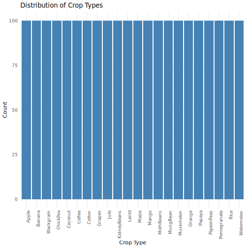

# 10. Histograms for numeric variables


``` r
ggplot(crop_data, aes(x = Nitrogen)) +
  geom_histogram(bins = 30, fill = "skyblue", color = "black") +
  labs(title = "Distribution of Nitrogen")
```


``` r
ggplot(crop_data, aes(x = Phosphorus)) +
  geom_histogram(bins = 30, fill = "skyblue", color = "black") +
  labs(title = "Distribution of Phosphorus")
```


``` r
ggplot(crop_data, aes(x = Potassium)) +
  geom_histogram(bins = 30, fill = "skyblue", color = "black") +
  labs(title = "Distribution of Potassium")
```

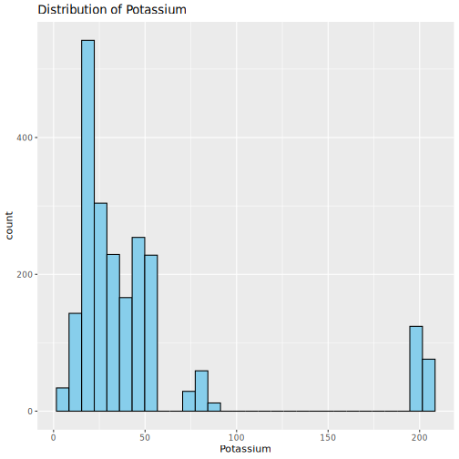

``` r
ggplot(crop_data, aes(x = Temperature)) +
  geom_histogram(bins = 30, fill = "skyblue", color = "black") +
  labs(title = "Distribution of Temperature")
```

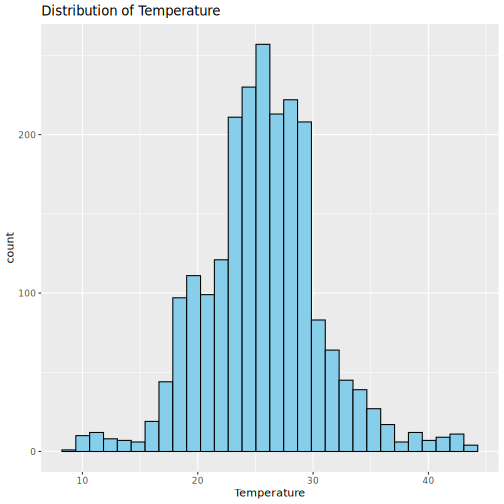

``` r
ggplot(crop_data, aes(x = Humidity)) +
  geom_histogram(bins = 30, fill = "skyblue", color = "black") +
  labs(title = "Distribution of Humidity")
```

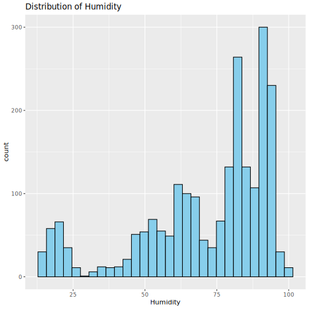

``` r
ggplot(crop_data, aes(x = pH_Value)) +
  geom_histogram(bins = 30, fill = "skyblue", color = "black") +
  labs(title = "Distribution of pH Value")
```

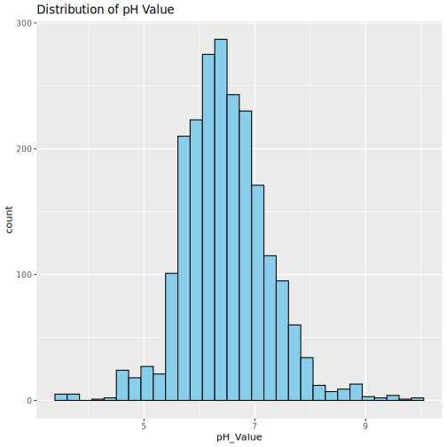

``` r
ggplot(crop_data, aes(x = Rainfall)) +
  geom_histogram(bins = 30, fill = "skyblue", color = "black") +
  labs(title = "Distribution of Rainfall")
```

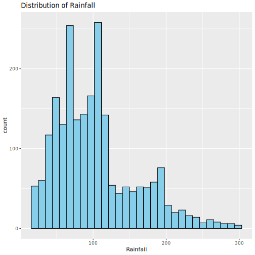


# 11. Boxplots to check spread and possible outliers

``` r
ggplot(crop_data, aes(y = Nitrogen)) +
  geom_boxplot(fill = "orange") +
  labs(title = "Boxplot of Nitrogen")
```

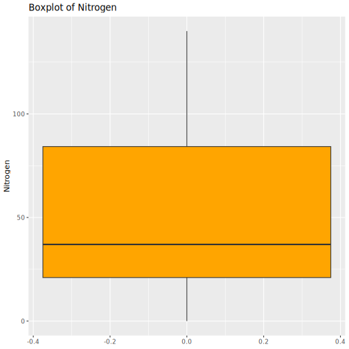

``` r
ggplot(crop_data, aes(y = Phosphorus)) +
  geom_boxplot(fill = "orange") +
  labs(title = "Boxplot of Phosphorus")
```

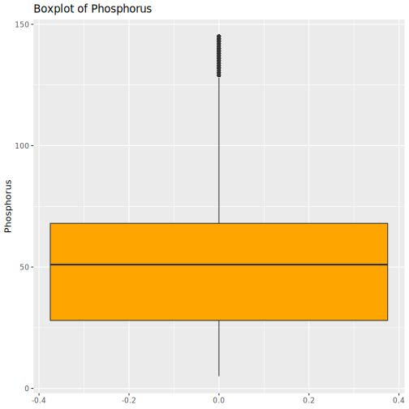

``` r
ggplot(crop_data, aes(y = Potassium)) +
  geom_boxplot(fill = "orange") +
  labs(title = "Boxplot of Potassium")
```

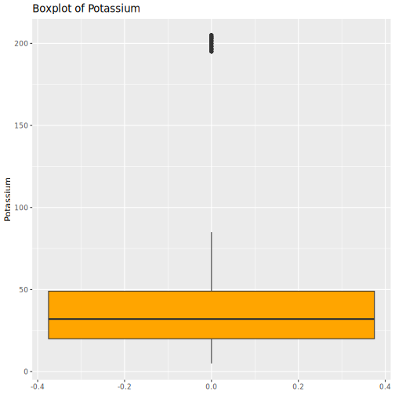

``` r
ggplot(crop_data, aes(y = Temperature)) +
  geom_boxplot(fill = "orange") +
  labs(title = "Boxplot of Temperature")
```

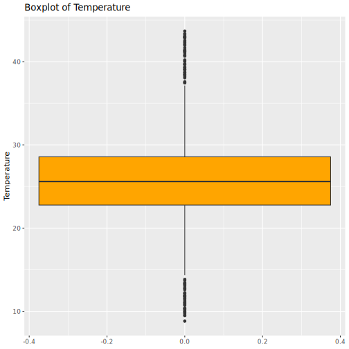

``` r
ggplot(crop_data, aes(y = Humidity)) +
  geom_boxplot(fill = "orange") +
  labs(title = "Boxplot of Humidity")
```

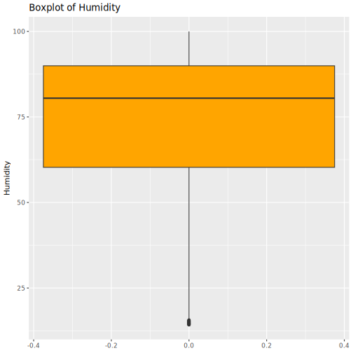

``` r
ggplot(crop_data, aes(y = pH_Value)) +
  geom_boxplot(fill = "orange") +
  labs(title = "Boxplot of pH Value")
```

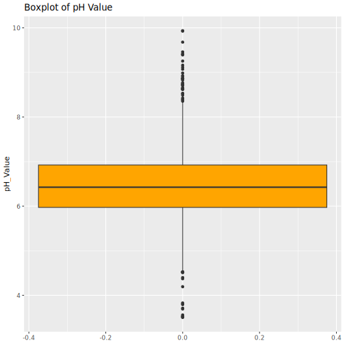

``` r
ggplot(crop_data, aes(y = Rainfall)) +
  geom_boxplot(fill = "orange") +
  labs(title = "Boxplot of Rainfall")
```

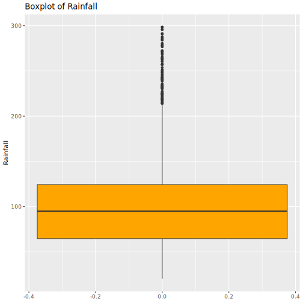

# 12. Correlation matrix for numeric variables


``` r
numeric_data <- crop_data %>%
  dplyr::select(Nitrogen, Phosphorus, Potassium, Temperature, Humidity, pH_Value, Rainfall)

cor_matrix <- cor(numeric_data)
print(cor_matrix)
```

```
##                Nitrogen  Phosphorus   Potassium Temperature     Humidity
## Nitrogen     1.00000000 -0.23145958 -0.14051184  0.02650380  0.190688379
## Phosphorus  -0.23145958  1.00000000  0.73623222 -0.12754113 -0.118734116
## Potassium   -0.14051184  0.73623222  1.00000000 -0.16038713  0.190858861
## Temperature  0.02650380 -0.12754113 -0.16038713  1.00000000  0.205319677
## Humidity     0.19068838 -0.11873412  0.19085886  0.20531968  1.000000000
## pH_Value     0.09668285 -0.13801889 -0.16950310 -0.01779502 -0.008482539
## Rainfall     0.05902022 -0.06383905 -0.05346135 -0.03008378  0.094423053
##                 pH_Value    Rainfall
## Nitrogen     0.096682846  0.05902022
## Phosphorus  -0.138018893 -0.06383905
## Potassium   -0.169503098 -0.05346135
## Temperature -0.017795017 -0.03008378
## Humidity    -0.008482539  0.09442305
## pH_Value     1.000000000 -0.10906948
## Rainfall    -0.109069484  1.00000000
```

# 13. Correlation heatmap


``` r
cor_df <- as.data.frame(as.table(cor_matrix))

ggplot(cor_df, aes(x = Var1, y = Var2, fill = Freq)) +
  geom_tile(color = "white") +
  geom_text(aes(label = round(Freq, 2)), size = 4) +
  labs(
    title = "Correlation Heatmap of Numeric Variables",
    x = "",
    y = "",
    fill = "Correlation"
  ) +
  theme_minimal()
```

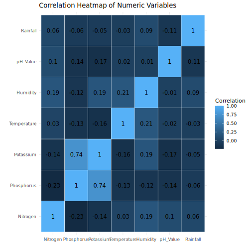

# 14. Scatterplots for some important relationships


``` r
ggplot(crop_data, aes(x = Nitrogen, y = Phosphorus, color = Crop)) +
  geom_point(alpha = 0.6) +
  labs(
    title = "Nitrogen vs Phosphorus by Crop",
    x = "Nitrogen",
    y = "Phosphorus"
  ) +
  theme_minimal()
```


``` r
ggplot(crop_data, aes(x = Temperature, y = Humidity, color = Crop)) +
  geom_point(alpha = 0.6) +
  labs(
    title = "Temperature vs Humidity by Crop",
    x = "Temperature",
    y = "Humidity"
  ) +
  theme_minimal()
```

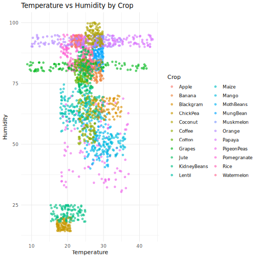

``` r
ggplot(crop_data, aes(x = Rainfall, y = pH_Value, color = Crop)) +
  geom_point(alpha = 0.6) +
  labs(
    title = "Rainfall vs pH Value by Crop",
    x = "Rainfall",
    y = "pH Value"
  ) +
  theme_minimal()
```

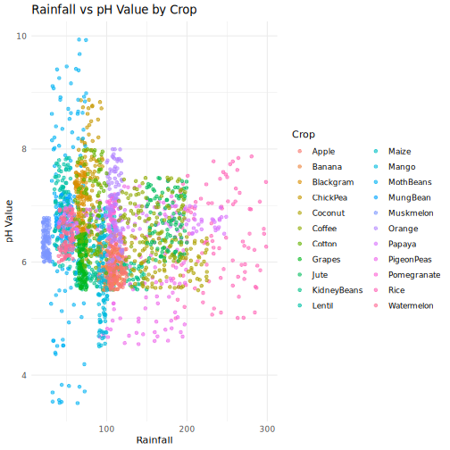

# 15. Mean values of numeric variables by crop


``` r
crop_means <- crop_data %>%
  group_by(Crop) %>%
  summarise(
    Mean_Nitrogen = mean(Nitrogen),
    Mean_Phosphorus = mean(Phosphorus),
    Mean_Potassium = mean(Potassium),
    Mean_Temperature = mean(Temperature),
    Mean_Humidity = mean(Humidity),
    Mean_pH = mean(pH_Value),
    Mean_Rainfall = mean(Rainfall)
  )

print(crop_means)
```

```
## # A tibble: 22 × 8
##    Crop        Mean_Nitrogen Mean_Phosphorus Mean_Potassium Mean_Temperature
##    <fct>               <dbl>           <dbl>          <dbl>            <dbl>
##  1 Apple                20.8           134.           200.              22.6
##  2 Banana              100.             82.0           50.0             27.4
##  3 Blackgram            40.0            67.5           19.2             30.0
##  4 ChickPea             40.1            67.8           79.9             18.9
##  5 Coconut              22.0            16.9           30.6             27.4
##  6 Coffee              101.             28.7           29.9             25.5
##  7 Cotton              118.             46.2           19.6             24.0
##  8 Grapes               23.2           133.           200.              23.8
##  9 Jute                 78.4            46.9           40.0             25.0
## 10 KidneyBeans          20.8            67.5           20.0             20.1
## # ℹ 12 more rows
## # ℹ 3 more variables: Mean_Humidity <dbl>, Mean_pH <dbl>, Mean_Rainfall <dbl>
```

# 16. Prepare long-format data for grouped mean plot


``` r
crop_means_long <- crop_means %>%
  pivot_longer(
    cols = -Crop,
    names_to = "Variable",
    values_to = "Mean_Value"
  )
```

# 17. Plot average values of variables by crop


``` r
ggplot(crop_means_long, aes(x = Crop, y = Mean_Value, fill = Variable)) +
  geom_col(position = "dodge") +
  labs(
    title = "Average Variable Values by Crop",
    x = "Crop",
    y = "Mean Value"
  ) +
  theme_minimal() +
  theme(axis.text.x = element_text(angle = 90, hjust = 1))
```

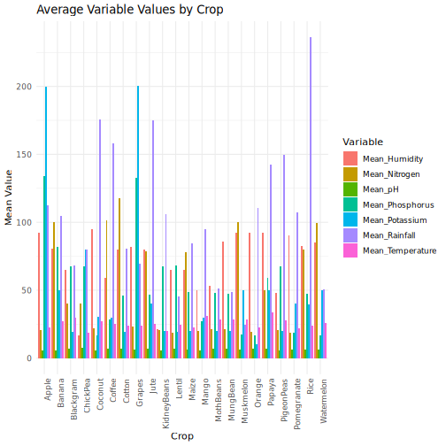
